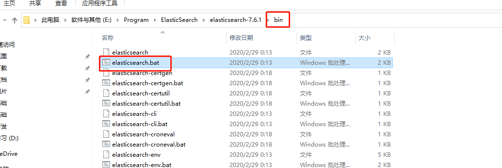

### 1、ElasticSearch安装

> 最低JDK 1.8

#### 1.1、解压


```java
bin 启动文件
config 配置文件
    log4j2 日志配置文件
    jvm.options java 虚拟机相关的配置
    elasticsearch.yml  elasticsearch 的配置文件！ 默认 9200 端口！ 跨域！
lib   相关jar包
logs   日志！
modules 功能模块
plugins 插件！
```

#### 1.2、启动



>  启动成功


- 如果启动不起来，在elasticsearch.yml末尾添加

```shell
xpack.ml.enabled: false
```

> 启动成功界面


### 2、安装可视化界面

#### 2.1、ElasticSearch Head插件

- 下载

  

- 启动

```shell
npm install
npm run start
```

- 第一次会出现以下情况

  

- 存在跨域问题：配置ES（ES-->config-->elasticsearch.yml）

```shell
http.cors.enabled: true
http.cors.allow-origin: "*"
```

- 重新启动ES，连接成功

  

> ElasticSearch Head插件简单的说就是一个数据展示工具，但后续均使用Kibana