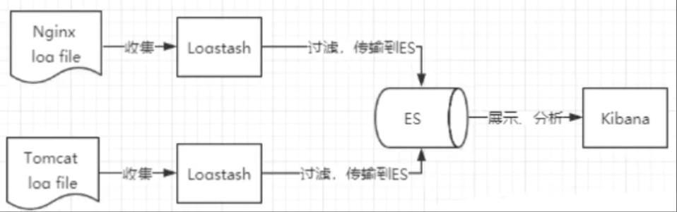
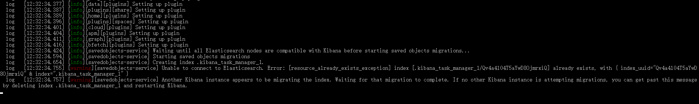
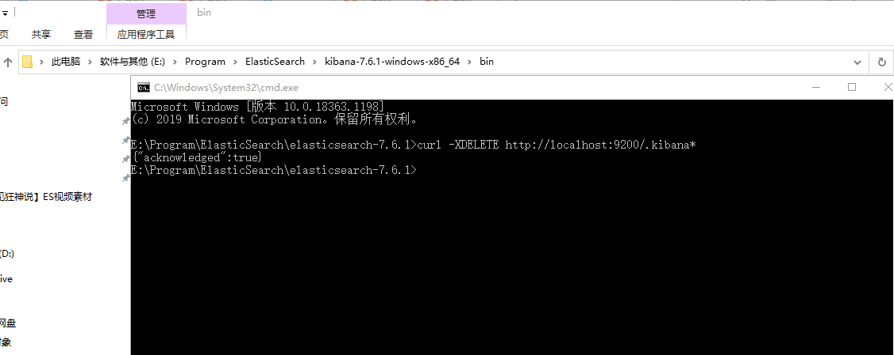

### 1、ELK简介

ELK是**Elasticsearch、Logstash、Kibana**三大开源框架首字母大写简称。市面上也被成为ElasticStack。其中Elasticsearch是一个基于Lucene、分布式、通过Restful方式进行交互的**近实时**搜索平台框架。像类似百度、谷歌这种大数据全文搜索引擎的场景都可以使用Elasticsearch作为底层支持框架。Logstash是ELK的**中央数据流引擎**，用于从不同目标（文件/数据存储/MQ）收集的不同格式数据，经过过滤后支持输出到不同目的地（文件/MQ/redis/elasticsearch/kafka等）。Kibana可以将elasticsearch的数据通过友好的页面展示出来，提供实时分析的功能。

- Es：搜索
- Logstash：收集数据
- Kibana：展示




### 2、安装Kibana

#### 2.1、简介

Kibana是一个针对Elasticsearch的开源分析及可视化平台，用来搜索、查看交互存储在Elasticsearch索引中的数据。使用Kibana，可以通过各种图表进行高级数据分析及展示。Kibana让海量数据更容易理解。它操作简单，基于浏览器的用户界面可以快速创建仪表板（dashboard）实时显示Elasticsearch查询动态。设置Kibana非常简单。无需编码或者额外的基础架构，几分钟内就可以完成Kibana安装并启动Elasticsearch索引监测

#### 2.2、启动





#### 2.3、汉化

- Kibana.yml文件中添加

```shell
i18n.locale: "zn-CH"
```

