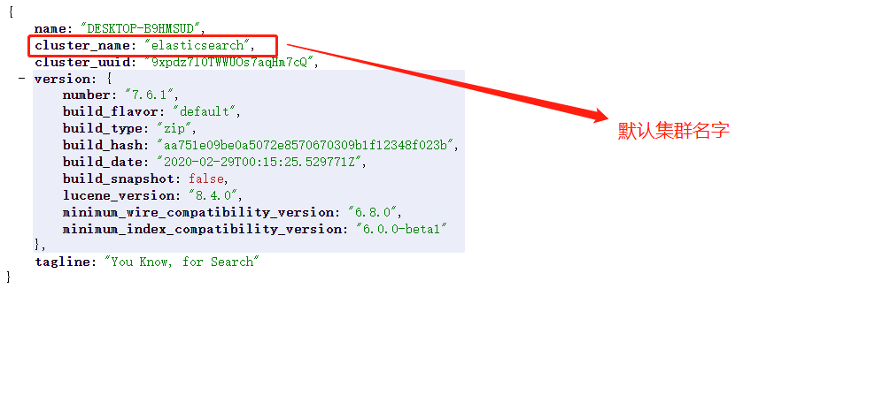
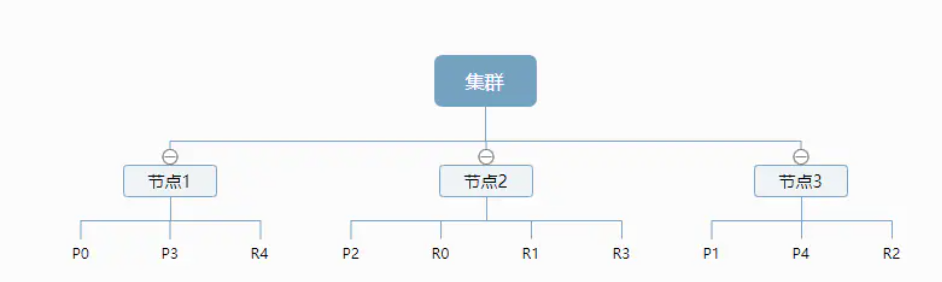
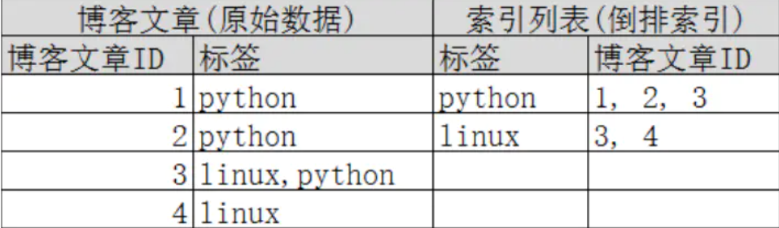

### 1、ElasticSearch

#### 1.1、概念

- 索引
- 字段类型（mapping）
- 文档（documents）

| 关系型数据库     | Elasticsearch |
| ---------------- | ------------- |
| 数据库(database) | 索引(indices) |
| 表(tables)       | types         |
| 行(rows)         | document      |
| 字段(columns)    | field         |

#### 1.2、设计

- 逻辑设计

  - ES在后台把每个索引划分成多个分片，每个分片可以在集群中的不同服务器中转移

  - 一个人就是一个集群

  

- 逻辑设计

  - 一个索引类型，包含多个文档，当我们索引一篇文档时，可以通过这样的顺序找到他： 索引->类型->文档id（该id实际是个字符串），通过这个组合我们就能索引到某个具体的文档。

### 2、字段介绍

#### 2.1、索引

> 通俗的理解，就是我们的数据库

索引是映射类型的容器（数据库），ES中的索引是一个非常大的文档集合（一条条数据）。索引存储了映射类型的字段和其他设置，然后它们被存储在各个分片上。

- 物理设计


一个集群至少有一个节点，而一个节点就是一个ElasticSearch进程。【如上图设置】节点可以有多个索引，索引会有五个分片（primary shard主分片）构成的，每一个主分片会有一个副本（replica shard复制分片）



上图是一个有3个节点的集群，可以看到主分片和对应的复制分片都不会在同一个节点内，这样有利于某个节点挂掉 了，数据也不至于丢失。 实际上，一个分片是一个Lucene索引，一个包含倒排索引的文件目录，**倒排索引**的结构使 得elasticsearch在不扫描全部文档的情况下，就能告诉你哪些文档包含特定的关键字。

##### 2.1.1、倒排索引

> ElasticSearch使用的就是**倒排索引**的结构，采用Lucene倒排索作为底层。这种结构很适合快速的全文搜索。

- 倒排索引：一个索引由文档中所有不重复的列表构成，对于每一个词，都有一个包含它的文档列表。

例如：现在有两个文档，文档内容如下：

```shell
Study every day, good good up to forever  # 文档1包含的内容
To forever, study every day, good good up # 文档2包含的内容
```

为了创建倒排索引，我们首先要将每个文档拆分成独立的词(或称为词条或者tokens)，然后创建一个包含所有不重 复的词条的排序列表，然后列出每个词条出现在哪个文档 :

| term    | doc_1 | doc_2 |
| ------- | ----- | ----- |
| Study   | √     | x     |
| To      | x     | x     |
| every   | √     | √     |
| forever | √     | √     |
| day     | √     | √     |
| study   | x     | √     |
| good    | √     | √     |
| every   | √     | √     |
| to      | √     | x     |
| up      | √     | √     |

现在，我们试图搜索 to forever，只需要查看包含每个词条的文档 score

| term    | doc_1 | doc_2 |
| ------- | ----- | ----- |
| to      | √     | ×     |
| forever | √     | √     |
| total   | 2     | 1     |

两个文档都匹配，但是第一个文档比第二个匹配程度更高。如果没有别的条件，现在，这两个包含关键字的文档都将返回。

再来看一个示例，比如我们通过博客标签来搜索博客文章。那么倒排索引列表就是这样的一个结构 :



如果要搜索含有 python 标签的文章，那相对于查找所有原始数据而言，查找倒排索引后的数据将会快的多。只需要 查看标签这一栏，然后获取相关的文章ID即可。完全过滤掉无关的所有数据，提高效率！

> 在elasticsearch中， 索引 （库）这个词被频繁使用，这就是术语的使用。 在elasticsearch中，索引被分为多个分片，每份 分片是一个Lucene的索引。所以一个elasticsearch索引是由多个Lucene索引组成的。别问为什么，谁让elasticsearch使用Lucene作为底层呢! 如无特指，说起索引都是指elasticsearch的索引。

### 2.2、类型

- 类型是文档的逻辑容器，就像关系型数据库一样，表格是行的数据，就是我们常说的数据表。
- 类似中对于字段的定义称为映射，比如name映射为字符串类型。
- 我们说文档是舞模式的，他们不需要拥有映射中所定义的所有字段，比如新增一个字段，在ElasticSearch中，会自动的将新字段加入映射，但是此时不确定此字段的类型，ElasticSearch就开始猜，如果值是数字10，可能就会认为是整形，但最安全的方式，就是提前定义好所需要的映射，就像我们关系型数据库中定义字段一样，添加对应类性。

#### 2.4、文档

> 简单的说，就是我们关系型数据库中的一条条数据。ElasticSearch是面向文档的，所以索引和搜索数据的最小单位是文档

- key-value形式
- 可以是层次形的（就像我们使用的json一样）

- 文档不依赖预先定义的模式，们知道关系型数据库中，要提前定义字段才能使用，在elasticsearch中，对于字段是非常灵活的，有时候，我们可以忽略该字段，或者动态的添加一个新的字段。

尽管我们可以随意的新增或者忽略某个字段，但是，每个字段的类型非常重要，比如一个年龄字段类型，可以是字符 串也可以是整形。因为elasticsearch会保存字段和类型之间的映射及其他的设置。这种映射具体到每个映射的每种类型，这也是为什么在elasticsearch中，类型有时候也称为映射类型

