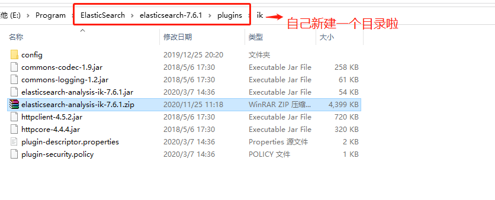
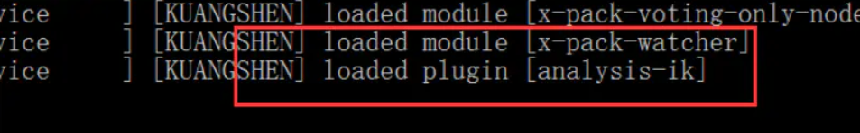
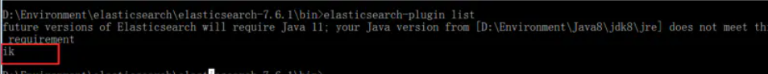
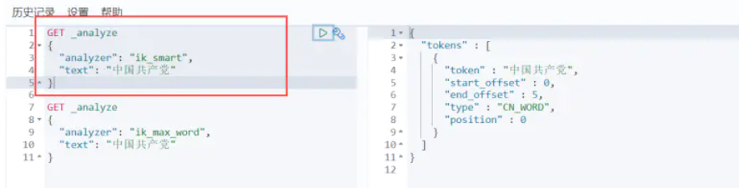
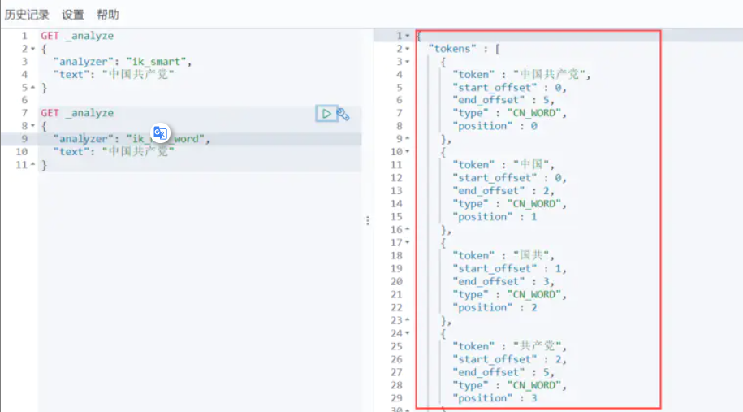
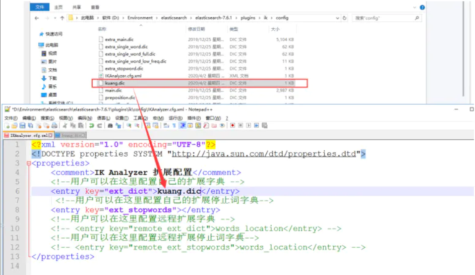
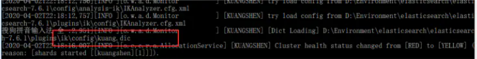

### 1、分词器

#### 1.1、分词

- 就是把一段中文或者别的划分成一个个关键字，我们搜索的时候就会把自己的信息进行分词，会把数据库或者索引库中的数据进行分词，然后进行匹配操作。

  > 默认的中文分词，是把每一个字都当成一个词，例如“我爱中国”，会被分成“我”“爱”“中”“国”，显然不符合逻辑的

#### 1.2、IK分词器

- 为了分词中文

IK提供了两个分词算法：ik_smart 和 ik_max_word，其中 ik_smart 为最少切分，ik_max_word为最细粒度划分！

#### 1.3、解压

- 重启ElacticSearch

  

- elasticsearch-plugin 可以通过这个命令来查看加载进来的插件

### 2、Kibana测试

#### 2.1、ik_smart

> 最少切分

#### 2.2、ik_max_word

> 最细粒度划分！穷尽词库的可能！字典！

#### 2.3、自定义分词

- 重启ElasticSearch，会加载显示

  

- 效果

