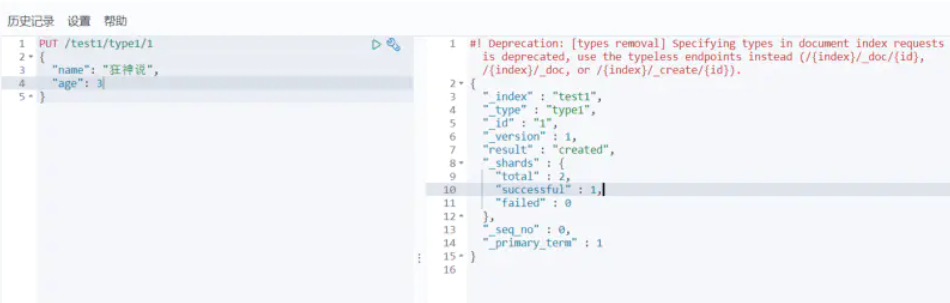
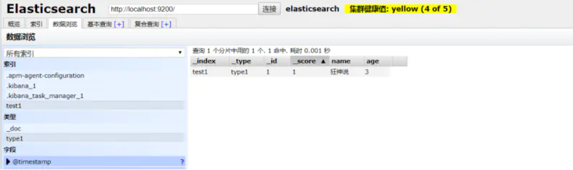
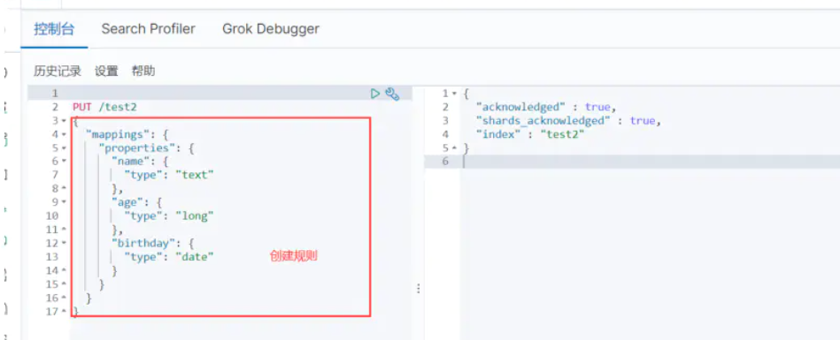
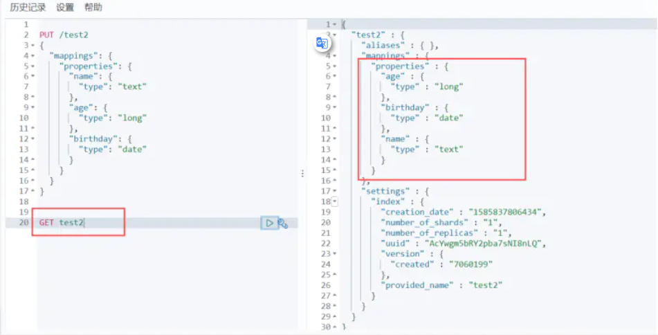
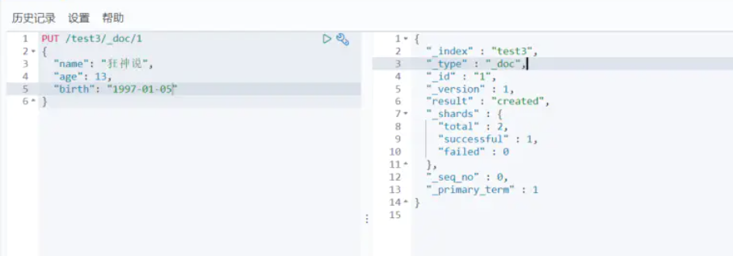
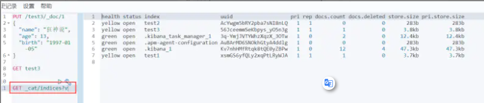
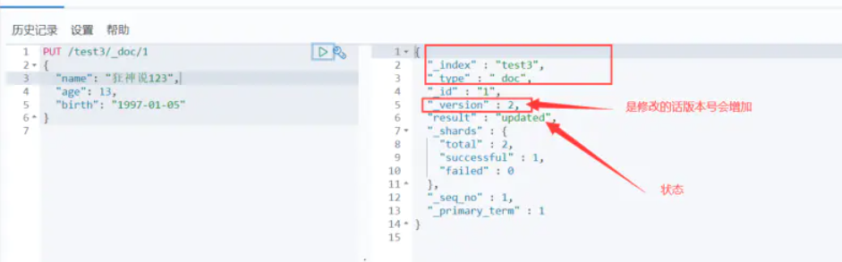
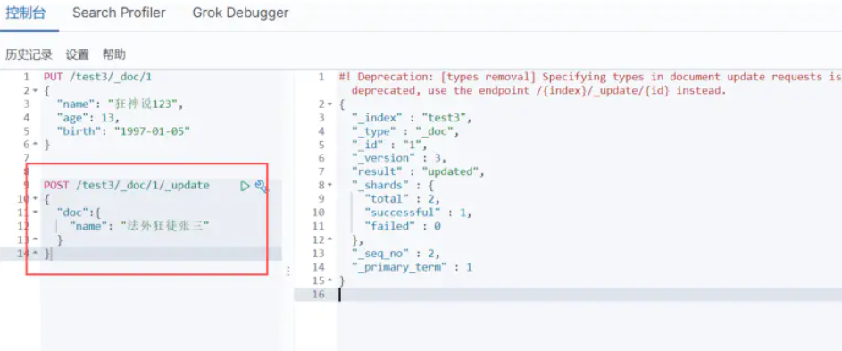

### 1、Rest风格

> 一种软件架构风格，而不是标准，只是提供了一组设计原则和约束条件。它主要用于客户端和服务器交互类的软件。基于这个风格设计的软件可以更简洁，更有层次，更易于实现缓存等机制。

| method | url地址                                         | 描述                   |
| ------ | ----------------------------------------------- | ---------------------- |
| PUT    | localhost:9200/索引名称/类型名称/文档id         | 创建文档（指定文档id） |
| POST   | localhost:9200/索引名称/类型名称                | 创建文档（随机文档id） |
| POST   | localhost:9200/索引名称/类型名称/文档id/_update | 修改文档               |
| DELETE | localhost:9200/索引名称/类型名称/文档id         | 删除文档               |
| GET    | localhost:9200/索引名称/类型名称/文档id         | 查询文档通过文档id     |
| POST   | localhost:9200/索引名称/类型名称/_search        | 查询所有数据           |

### 2、索引的基本操作

#### 2.1、创建一个索引

```restructuredtext
PUT /索引名/~类型名~/文档id
{请求体}
```



- 查看



那么 name 这个字段用不用指定类型呢。毕竟我们关系型数据库 是需要指定类型的啊 !

- 字符串类型
   text 、 keyword
- 数值类型
   long, integer, short, byte, double, float, half_float, scaled_float
- 日期类型
   date
- 布尔值类型
   boolean
- 二进制类型
   binary
- 等等.....

#### 2.2、指定字段类型



- 获得这个规则！ 可以通过 GET 请求获取具体的信息！



#### 2.3、查看默认信息



如果自己的文档字段没有指定，那么es 就会给我们默认配置字段类型！

**扩展**： 通过命令 elasticsearch 索引情况！ 通过get _cat/ 可以获得es的当前的很多信息！



#### 2.4、修改索引

>  修改 提交还是使用PUT 即可！ 然后覆盖！最新办法！





#### 2.5、删除索引

