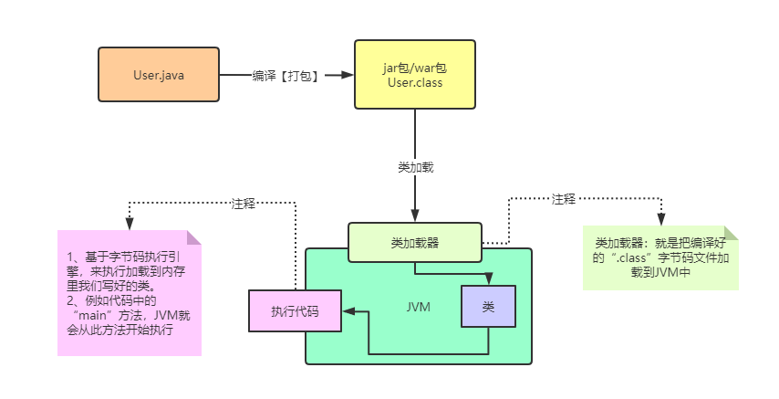
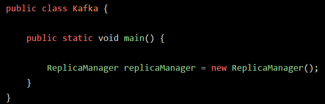
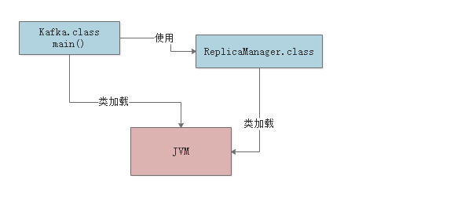
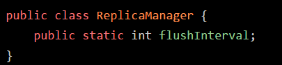
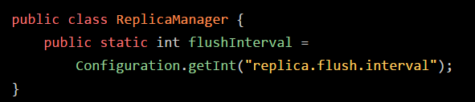
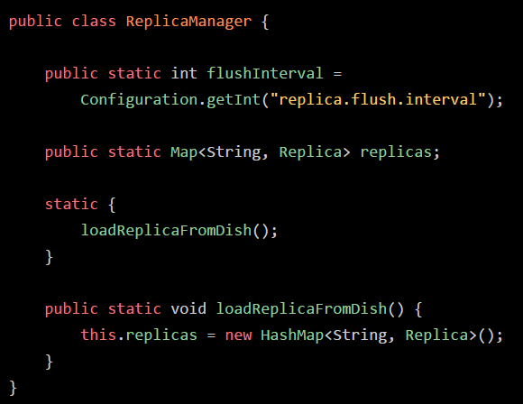
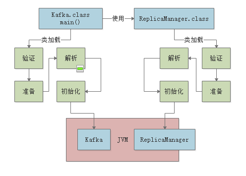

### 1、代码是怎么运行起来的？

### 2、类加载

>  简单地说，就是将编译好的".class"字节码文件加载到JVM中。

#### 2.1、类加载过程

加载->验证->准备->解析->初始化->使用->卸载

##### 2.1.1、整体概述

> 需要使用到的时候就会加载某个具体的类

#### 

- main方法的主类会在JVM进程启动之后被加载到内存，开始执行main方法中的代码，之后遇到使用的"ReplicManager"类，此时就会从相应的".class"字节码文件中加载对应的类到内存中来。

##### 2.1.2、验证、准备、初始化

###### 1、验证

校验加载进来的".class"文件内容是否符合指定规范，避免字节码被人篡改了，不符合规范，也执行不来。

###### 2、准备

- 验证完毕后，为“ReplicaManager”类分配内存空间
- 类变量（static修饰过的变量）分配内存空间，以及默认的初始值【上述的不就给个初始值“0”咯】

> 此阶段就是给加载进来的类分配好了内存空间、类变量分配好内存空间以及给了默认初始值

###### 3、解析

- 符号引用替换为直接引用

###### 4、初始化

> 此阶段正式执行类初始化代码

上述的代码需要注意如下几个点：

- 准备阶段中：仅仅给“flushInterval”类变量分配内存空间，以及初始化值“0”
- 初始化阶段：才会通过Configuration.getInt()获取对应的值，并且赋值给类变量“flushInterval”

下图更是如此：类初始化的时候，才会调用"loadReplicaFromDish"方法从磁盘中加载到数据副本，并且放在静态变量“replicas”中

##### 2.1.3、什么时候初始化一个类

1. new一个类的对象，就会触发类的初始化全过程，把这个类准备好，然后再实例化一个对象出来
2. main方法的主类，必须立马初始化
3. 初始化一个类的时候，发现父类还未初始化，必须先初始化他的父类

##### 2.1.4、总结

- 类是在准备阶段分配内存空间的
- 实例变量得在创建类的实例变量时才会初始化
- 类的初始化阶段，仅仅是初始化类而已，跟对象无关，用new关键字才会构造出一个对象来