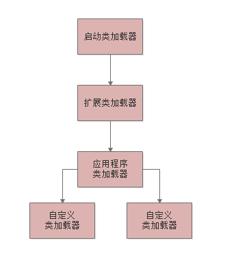
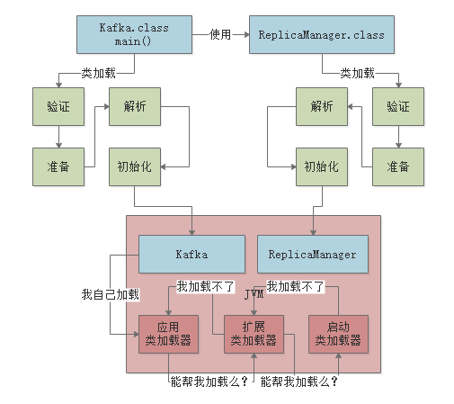

### 1、类加载器

#### 1.1、种类

##### 1、启动类加载器

- Bootstrap ClassLoader：负责加载我们在机器上安装的Java目录下的核心类
- 如我们java目录下的“lib”目录

> JVM一旦启动，就会第一时间依托启动类加载器，加载安装目录下的"lib"核心类库

##### 2、扩展类加载器

- Extension ClassLoader：与启动类加载器类似，加载"lib\ext"目录里面的类，支撑系统的运行

> JVM一旦启动，就会第一时间依托启动类加载器，加载安装目录下的"lib\ext"目录核心类库

##### 3、应用程序类加载器

- Application ClassLoader：负责加载“ClassPath”环境变量所指定的路径中的类

> 简单的理解：就是加载我们自己写的类

##### 4、自定义类加载器

- 根据自己特定的需求加载类

#### 2、类加载器总结

> 此亲子层次结构，就是双亲委派机制

### 3、双亲委派机制

#### 3.1、双亲委派机制

> 假设应用程序需要加载某一个类，他首先会委派自己的父类加载器去加载，最终传导到顶层的类加载器去加载，如果父类加载器在自己负责加载的范围内没找到此类，则会下推加载权力给自己的子类加载器。

双亲委派模型：先找父类去加载，不行的化再由儿子来加载；这样可以避免多层级的加载器结构重复加载某些类

#### 3.2、双亲委派机制为什么是从下往上找？

- 每一层的加载器对某个类的加载，上推给父类加载器，到顶层类加载器，如果发现自己加载不到，再下推回子类加载器来加载，这样可以保证绝对不会重复加载某个类
- 类加载器本身就是**父子关系模型**，如果通过顶层加载器往下找的话，是不太合适的，这样顶层加载器就必须硬编码了。