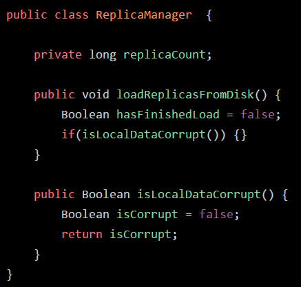

### 1、内存区域划分

#### 1.1、为什么需要内存区域划分

- 试想一下，当代码运行起来的时候，是需要执行我们写的一个个方法的，方法中又存在许多的变量等东西，此实内存区域的划分就很重要了。

#### 1.2、方法区-->元空间

- JDK1.8之前的版本，此区域代表JVM的一块区域，主要用来存放加载进来的".class"类，还有一些类似常量池的东西放在这个区域。
- JDK1.8以后，此区域改名为“Metaspace”元数据空间（元空间），主要就是存放我们自己写的各种类相关的信息。

上述代码，加载到JVM后，如下图所示

#### 1.3、程序计数器

我们都知道，我们写好的.java文件是要经过编译转换成".class"字节码文件的，如下图所示

写好的Java代码，就会编译成字节码，对应各种字节码指令，如“0:aload_0”所示。

---

JVM加载类信息到内存后，就会使用字节码执行引擎去执行我们写好的代码编译出来的代码指令，那么在执行字节码指令的时候，JVM就需要使用到一个特殊的内存区域---**程序计数器**。

程序计数器：就是用来记录当前执行的字节码指令的位置，就是记录当前执行到那一条字节码指令

##### 1.3.1、为什么一定要程序计数器

- JVM是多线程的，所以我们写好的代码是可能会开启多个线程并发执行的，所以就会有多个线程来并发的执行不同的代码指令，因此，每一个线程都会有自己的一个程序计数器，专门记录当前这个线程目前执行到哪一条字节码指令了

#### 1.4、虚拟机栈

Java虚拟机栈：用来保存每个方法内的**局部变量**等数据，**每个线程都有自己的Java虚拟机栈**

- 如果线程执行了一个方法，**就会对这个方法调用创建对应的一个栈帧**
- 栈帧里就有方法内使用到的局部变量、操作数栈、方法出口等东西

---

执行如下所示：

解析：如果"isLocalDataCorrupt"方法执行完毕后，就会把"isLocalDataCorrupt"方法对应的栈帧从Java虚拟机栈里给出栈，然后当“loadReplicasFromDisk”方法执行完毕后，也会从虚拟机出栈。

> Java虚拟机栈：调用执行任何方法时，就会给方法创建栈帧然后入栈

#### 1.5、堆内存

- Java堆内存区域里会放入类似ReplicaManager的对象，然后因为在main方法里创建了ReplicaManager对象，那么就会在main方法对应的栈帧的局部变量表里，让一个引用类型的“replicaManager”局部变量来存放ReplicaManager对象的地址
- 简单认为就是局部变量表里的"replicaManager"指向了Java堆内存里的ReplicaManager对象

#### 1.6、本地方法栈

- JDK很多底层都不是Java代码，例如IO相关的、网络Socket相关的等，会发现这些会使用native进行修饰。
- public native int hashCode();
- 调用这种native方法的时候，就会有线程对应的本地房发展，就是类似于Java虚拟机栈，也是存放各种native方法的局部变量表之类的信息

### 2、总结

1. JVM进程启动，加载Kafka类到内存
2. main线程，执行Kafka中的main方法，并且关联了一个程序计数器，记录执行到哪一行指令
3. main线程执行main方法时，会在main线程关联的Java虚拟机栈，压入一个main方法的栈帧
4. 创建一个ReplicaManager类的实例变量，此时会加载ReplicaManager类到内存里来
5. 创建一个ReplicaManager的对象实例分配到Java堆内存里，并在main方法的栈帧里的局部变量表引入一个“replicaManager”变量，让此变量引用堆内存中的ReplicaManager地址
6. main线程开始执行ReplicaManager对象中的方法，会依次把自己执行到的方法对应的栈帧压入到自己的Java虚拟机栈
7. 执行完方法后，再把方法对应的栈帧从Java虚拟机中进行出栈