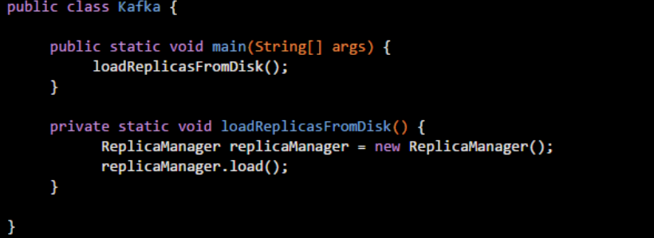
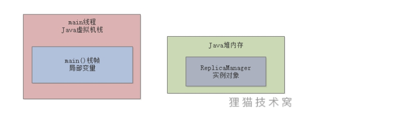
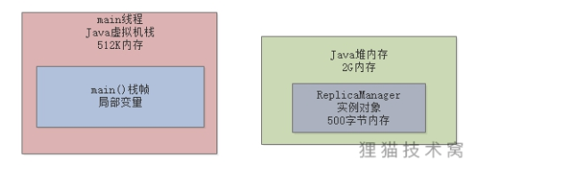
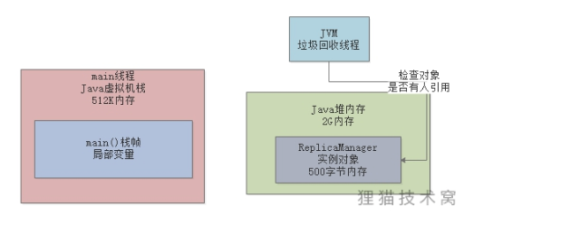

### 1、垃圾回收

#### 1.1、方法执行完毕后会怎么样？

- 一个方法里的代码执行完毕后，那么方法就执行完毕了
- 例如上图，一旦loadReplicasFromDisk()方法执行完毕后，此时就会把loadReplicasFromDisk()方法对应的栈帧从main线程的Java虚拟机栈里出栈

---

也就是说，当loadReplicasFromDisk方法的栈帧出栈后，栈帧中的局部变量"replicaManager"就没有了，也就是说，没有任何一个变量执行Java堆内存里的“ReplicaManager”实例对象

#### 1.2、创建的对象占用内存资源吗？

> 我们在Java堆内存里创建的对象，都是占用内存资源的，而且资源也是有限的

#### 1.3、垃圾回收机制

垃圾回收机制：JVM自带的，且是一个后台自动运行的线程，只要启动了JVM进程，他就会自带一个垃圾回收的后台线程，此线程会在后台不断检查JVM堆内存中的各个实例对象

- 某个对象没有任何一个方法的局部变量执行它，也没有任何一个类的静态变量，包括常量等地方指向他，此实例对象就会被回收掉，从内存里清除掉，让他不再占有任何内存资源

> 不再被人指向的对象实例，即JVM中的“垃圾”，就会被后台垃圾回收线程定期清理掉，不断释放内存资源