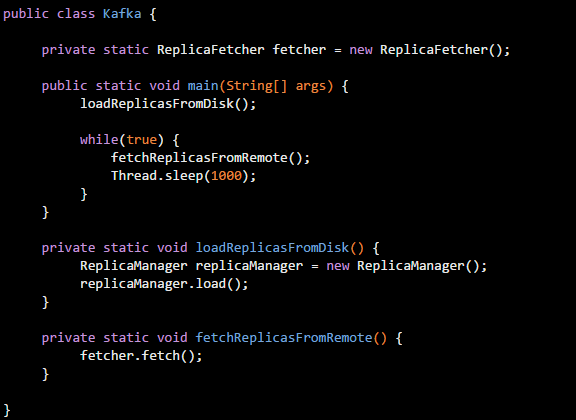
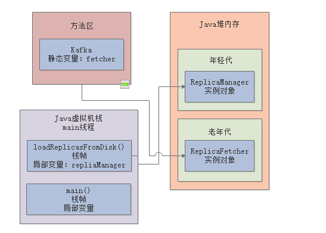

### 1、分代模型

> 采用不同的方式创建和使用对象，对应对象的生存周期是不同的

- JVM内存的分代模型：年轻代、老年代、永久代

分代的好处：对于各种对象，根据存活时间不同，可分配在不同的区域，后续进行垃圾回收可采用不同的垃圾回收算法

#### 1.1、年轻代

> 很快就要被回收的对象

- **大部分的正常对象，都是优先在新生代分配内存的**
- 不管是类静态变量还是实例变量，一开始都会先进入年轻代的

##### 1.1、年轻代垃圾回收

- 当新生代内存空间不够时，就会触发新生代内存空间的垃圾回收，尝试回收掉新生代中无人引用的垃圾对象，以保证系统的正常运行，此方式称之为`Minor GC`或`Young GC`

#### 1.2、老年代

#### 1.2.1 、如何进入老年代

##### 1.十五次Minor GC

若一个实例对象在新生代，成功在15垃圾回收之后，任未被回收掉，每次垃圾回收年龄增长一岁，此时已经15岁了，会被转移到Java堆内存中的`老年代`中去，其中默认次数是15，可以通过JVM参数"`-XX:MaxTenuringThreshold`"设置

##### 2.动态年龄判断

- 新生代中放对象的Survivor区域里，一批对象的总大小大于了这块Survivor区域的内存大小的50%，那么此时大于等于这批对象年龄的对象，就直接进入老年代了

举例：就是说，最小年龄的开始相加，如年龄1+年龄2的对象已经占据Survivor的50%，那么年龄大于等于2的对象就直接进入老年代

##### 3、大对象直接进入老年代

- JVM参数：“`-XX:PretenureSizeThreshold`”，可以设置成“1048576”就是1MB，那么如果创建了一个大于这个大小的对象，例如数组之类的，就会直接把这个大对象放入老年代中去，压根就不会经过新生代

#### 1.3、永久代

- JVM的永久代就是我们所说的方法区
- 永久代就是存放一些类的信息

#### 1.3.1、方法区内也会进行垃圾回收

- 当该类的所有实例对象已经从Java堆内存里被回收
- 加载此类的ClassLoader已经被回收
- 对该类的Class对象没有任何引用

