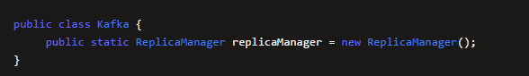
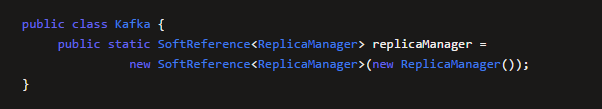
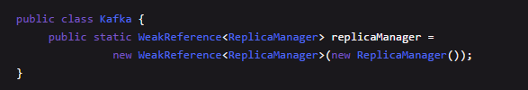
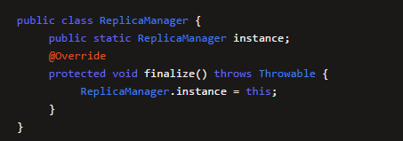

### 1、垃圾回收能回收哪些对象

#### 1.1、可达性分析算法

- 对每个对象都分析一下谁引用了他，然后一层一层往上判断，看是否存在`GC Roots`，存在GC Roots的就不能被回收了

#### 1.2、GC Roots

> 只要对象被方法的局部变量、类的静态变量引用了，就不会被回收

- 局部变量
- 静态变量

------

有GC Roots引用的对象不能回收，没有GC Roots引用的对象可以回收，如果有GC  Roots引用，但是如果是软引用或者弱引用，也可能会被回收掉

#### 1.3、引用类型

##### 1.3.1、强引用

- 一个变量引用一个对象，只要是强引用的类型，那么垃圾回收的时候绝对不会去回收这个对象 

##### 1.3.2、软引用

- 正常情况下垃圾回收是不会回收软引用的对象的，如果进行垃圾回收之后，发现内存空闲任然不够存放新对象，内存都快溢出了，此时就会把软引用对象回收掉，哪怕他被变量引用了，也是要回收的

- 就是把“ReplicaManager”实例对象用一个“SoftReference”软引用类型的对象包裹起来了，此时这个“replicaManager"变量对“ReplicaManager”对象的引用就是软引用

##### 1.3.3、弱引用

- 弱引用就跟没引用类似，如果发生垃圾回收，就会把这个对象回收掉

##### 1.3.4、虚引用

- 用的不多 知道就行

#### 1.4、finalize()方法

- 如果不想自己被立马回收掉，可以重写Object类中的`finialize()`方法，回收的时候会先调用此方法，若此时的实例对象又给了GC Roots变量的话，则不会被回收掉

