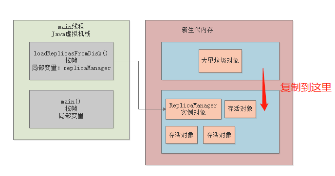
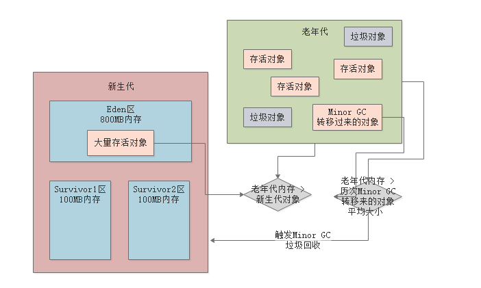
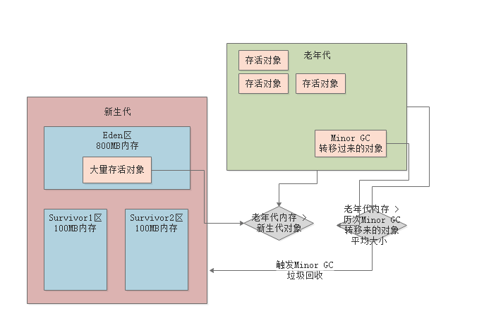

### 1、标记算法

- 标记哪些是垃圾对象，然后直接进行回收

---

结果：出现大量的**内存碎片**，内存碎片太多就会导致**内存浪费**，因为当内存碎片太多时，虽然内存碎片加起来可能还有很大的一块内存，但是内存太过于分散，导致没有一块完整的足够的内存空间来分配新的对象

### 2、复制算法

- 首先会把区域划分成两块，然后只能使用其中一块内存，两块内存区域重复循环使用

- 先把垃圾对象进行标记，没有被标记的就是存活对象，然后把存活对象复制到一块空白的内存中，并且排列可以很紧凑，按顺序排列，几乎没有内存碎片

缺点：内存使用率太低，只利用到一半的内存

### 3、复制算法（优化）【新生代】

> 把新生代内存区域划分成三块：1个Eden区，2个Survivor区，默认比例8：1：1

- 刚开始的对象都是分配在Eden区域，此区域快满了时，触发垃圾回收
- Eden中存活的对象都一次性转移到一块空的Survivor区，接着Eden区会被清空，然后再次分配新对象到Eden区
- 如果下一次Eden区域又满了，触发Minor GC，就会吧Eden区和上一次垃圾回收存活在Survivor内存活的对象，转移到另一个Survivor区去
- 始终保持一块Survivor区是空的，一直循环使用这三块内存区域

> 这样就可以利用到内存的90%的区域

### 4、标记整理算法【老年代】

- 标记老年代中垃圾对象
- 整理存活对象，让存活对象尽可能紧凑，避免出现过多的内存碎片
- 然后一次性把垃圾对象回收掉

- 标记整理算法至少比复制算法的速度慢10倍