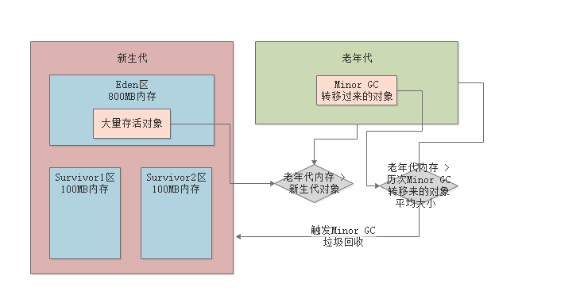

### 1、新生代进入老年代

#### 1.1、十五次Minor GC

若一个实例对象在新生代，成功在15垃圾回收之后，任未被回收掉，每次垃圾回收年龄增长一岁，此时已经15岁了，会被转移到Java堆内存中的`老年代`中去，其中默认次数是15，可以通过JVM参数"`-XX:MaxTenuringThreshold`"设置

### 1.2、动态年龄判断

- 新生代中放对象的Survivor区域里，一批对象的总大小大于了这块Survivor区域的内存大小的50%，那么此时大于等于这批对象年龄的对象，就直接进入老年代了

举例：就是说，最小年龄的开始相加，如年龄1+年龄2的对象已经占据Survivor的50%，那么年龄大于等于2的对象就直接进入老年代

#### 1.3、大对象直接进入老年代

- JVM参数：“`-XX:PretenureSizeThreshold`”，可以设置成“1048576”就是1MB，那么如果创建了一个大于这个大小的对象，例如数组之类的，就会直接把这个大对象放入老年代中去，压根就不会经过新生代

#### 1.4、Minor GC后存活的对象超过Survivor区

- 当发生GC时，发现Eden区域中的存活对象已经超过Survivor区，此时就必须把这些对象直接转移到老年代中去

### 2、老年代前置处理判断

#### 2.1、老年代空间分配担保规则

老年代空间大小>新生代需要进入老年代中的存活对象大小

- 为了保证老年代空间大于新生代垃圾回收之后的需要进入老年代里的存活对象内存大小，需要再任何一次Minor GC之前，JVM会先检查一下老年代可用的内存空间，是否大于新生代对象的总大小
- 大于新生代对象的总大小的原因是因为，Minor GC之后新生代的对象全部存活下来，而且全部需要转移到老年代中去

---

老年代空间大小<新生代需要进入老年代中的存活对象大小，且开启了参数

- 检查参数“-XX:-HandlePromotionFailure”是否设置
- 老年代的内存大小，是否大于之前每一次`Minor GC`后进入老年代的对象的平均大小

上述判断均满足：

1. `Minor GC`后，剩余的存活对象的大小，是小于`Survivor`区的大小，那么此时的存活对象进入`Survivor`区域即可
2. `Minor GC`后，剩余的存活对象的大小，是大于`Survivor`区的大小，但是小于老年代可用的内存大小的，此时进入老年代区域即可
3. `Minor GC`后，剩余的存活对象的大小，是大于`Survivor`区的大小，且大于老年代可用的内存大小的,此时发生`Handle Promotion Failure`情况，此时触发一次`Full GC`

---

老年代空间大小<新生代需要进入老年代中的存活对象大小，未开启了参数

- 触发`Full GC`

### 3、Full GC

- 就是对老年代进行垃圾回收，同时一般也会对新生代进行垃圾回收
- 因为此时必须把老年代中没人引用的对象回收掉，然后才可能让Minor GC过后的剩余存活对象进入老年代中
- 一般速度很慢的，所以需要尽可能减少`Full GC`的次数

---

- 若Full GC后，老年代还是没有足够的空间存放`Minor GC`过后的剩余存活对象，那么就会导致**OOM内存溢出**