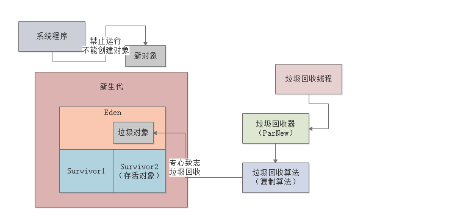
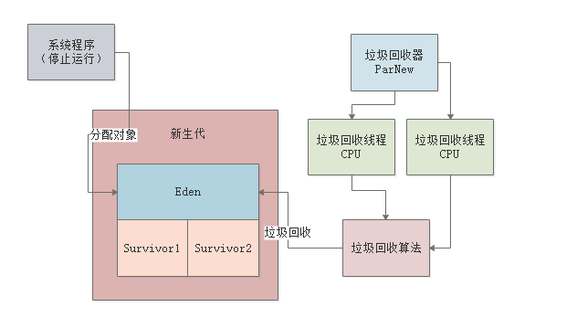
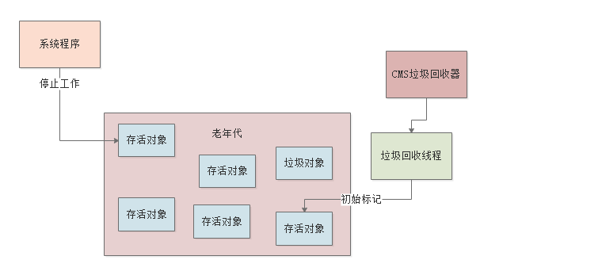
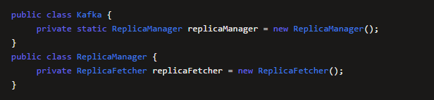
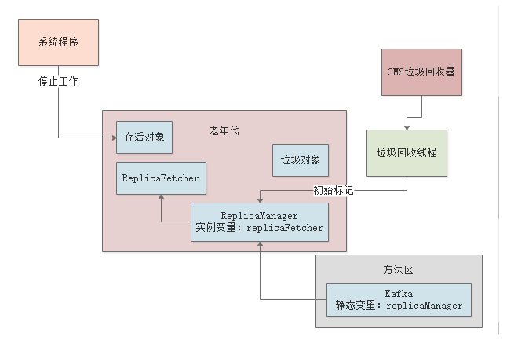
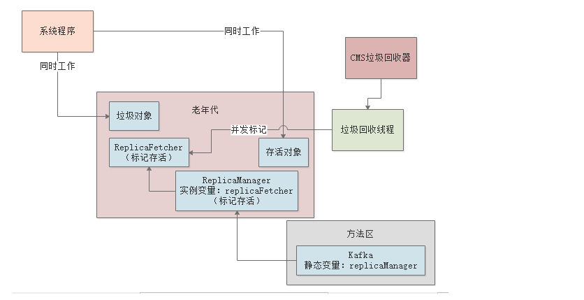
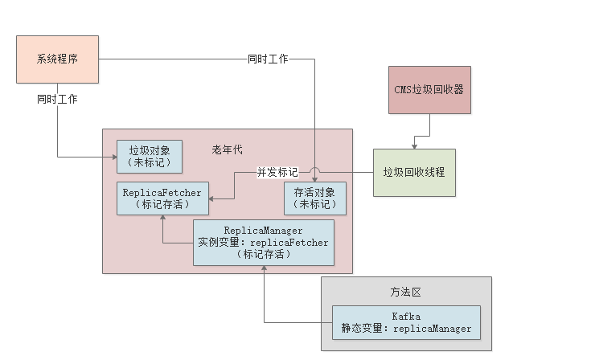
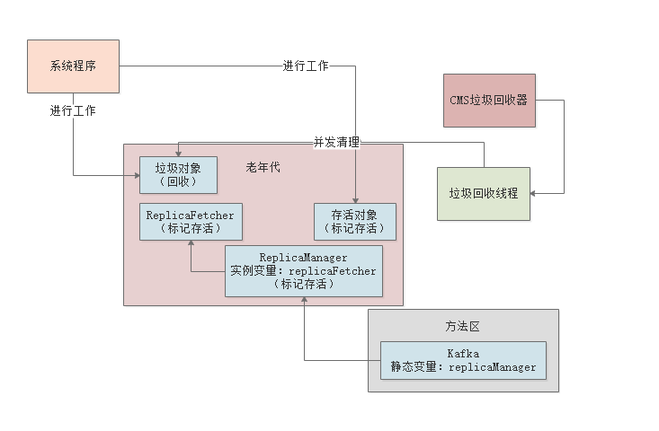

### 1、垃圾回收器

#### 1.1、简介

- 新生代和老年代进行垃圾回收时，都要用垃圾回收器进行回收的，不同的区域用不同的垃圾回收器

#### 1.2、垃圾回收器

- `Serial`和`Serial Old`垃圾回收器：分别用来回收新生代和老年代的垃圾对象，均是单线程，垃圾回收时会停止我们自己写的系统的其他工作线程，让我们的系统卡死不动，然后让他们垃圾回收。几乎不采用此方式
- `ParNew`和`CMS`垃圾回收器，`ParNew`一般是用在新生代的垃圾回收器，`CMS`一般是用在老年代的垃圾回收器，均是多线程，多线程并发执行，性能更加好
- `G1`垃圾回收器：统一收集新生代和老年代，采用更加优秀的算法和设计机制

### 2、Stop the World（STW）

- 如果在GC的时候任然允许系统在新生代的Eden区中创建新对象，会使得JVM处理异常不易实现，所以一边GC一边又允许创建新对象是非常不适合的，所以需要进入`Stop the World`状态，也就是停止Java系统的所有工作线程，让代码停止运行，专心致志执行GC

  

痛点：

- `Stop the World`会造成系统停止运行，造成卡顿现象，如果频繁GC则会严重影响系统的使用

### 3、ParNew（新生代-多线程）

> 常用的新生代垃圾回收器

- 开启`ParNew`垃圾回收器：`-XX:+UseParNewGC`
- 若机器是4核CPU、8核CPU，对应默认`ParNew`垃圾回收线程数分别是4个线程、8个线程，一般不用自己手动去调节。设置垃圾回收线程数量：`-XX:ParalleGCThreads`参数

### 4、CMS(老年代-多线程)

> 老年代常用垃圾回收器，并且一般采用标记整理算法

- 标记整理算法是非常耗时的，所以CMS垃圾回收器采取的是垃圾回收线程和工作线程尽量同时执行的模式来处理的
- 一边工作的同时进行垃圾回收

#### 4.1、垃圾回收处理阶段

- 处理阶段：初始标记、并发标记、重新标记、并发清理

##### 4.1.1、初始标记

> 此阶段处理的很快，影响很低，因为仅仅标记`GC Roots`直接引用的那些对象

- 系统工作线程全部停止，进去`Stop the World`状态

> 方法的局部变量和类的静态变量是`GC Roots`，但是类的实例变量并不是`GC Roots`

- 标记出所有`GC Roots`直接引用的对象
- 如下图，只会标记`replicaManager`这个类的静态变量代表的`GC Roots`，并且去标记出来他直接引用的`ReplicaManager`对象，而不会去管`ReplicaFetcher`这种对象，因为他是被`ReplicaManager`实例变量引用的

#####  4.1.2、并发标记（最耗时）

> 此阶段会对老年代所有对象进行GC Roots追踪，因为需要追踪所有对象是否从根源上被GC Roots引用了，是最耗时的，但是因为系统是并发执行的，所以此阶段影响也不会很大

- 系统线程可以随意创建各种新对象，继续运行
- 运行期间可以创建新的存活对象，也可能让部分存活的对象失去引用，变成垃圾对象
- 此阶段，垃圾回收线程会尽可能的对已有的对象进行`GC Roots`追踪
  - 追踪，意思是对类似`ReplicaFetcher`之类的全部老年代里的对象，看看被谁引用了，例如被`ReplicaManager`对象的实例变量引用，接着又会看，`ReplicaManager`对象被谁引用了，发现是`Kafka`类的静态变量引用了，此时就认定`ReplicaFetcher`对象是被`GC Roots`间接引用了

##### 4.1.3、重新标记

> 再次进入`Stop the World`状态，对第二阶段中被系统程序运行变动过的少数对象进行标记，此阶段速度也很快

- 第二阶段，一边标记存活对象和垃圾对象，一边系统不停运行创建对象，让老对象变成垃圾，所以第二阶段结束后，会有很多存活对象和垃圾对象，是之前第二阶段没有标记出来的

##### 4.1.4、并发清理（最耗时）

> 此阶段很耗时，因为需要进行对象的清理，但是系统程序是并发执行的，所以不会影响系统程序的执行

- 此阶段，系统程序随意运行，然后他来清理掉之前标记的垃圾对象即可

