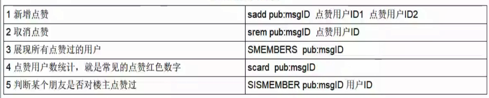
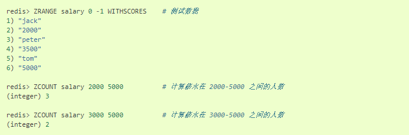
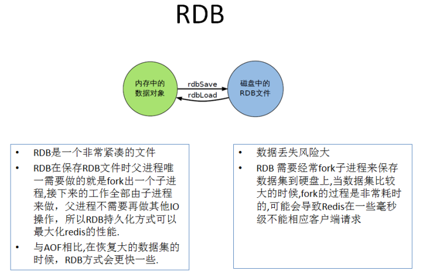

# 基本数据结构

> 命令不区分大小写，而key是区分大小写的

## String（字符串）

- 字符串是动态字符串，是可以修改的字符串，内部结构实现上类似于Java的`ArrayList`，采用**预分配冗余空间的方式来减少内存的频繁分配**
- 字符串最大的长度为512M

## List（列表）

- 列表相当于Java语言里面的`LinkedList`，是链表不是数组，意味着列表List插入和删除非常快，时间复杂度都是O(1)，但是索引定位很慢，时间复杂度为O(n)
- 当列表弹出了最后一个元素后，该数据结构自动被删除，内存被回收
- 列表结构常用来做异步队列使用，将需要延后处理的任务结构体序列化成字符串塞进`Redis`列表，另一线程从这个列表轮询数据进行处理。

------

- 右边进左边出：队列
  - `rpush` --->`lpop`
- 右边进右边出：栈
  - `rpush` --->`rpop`

## Hash（字典）

- 字典相当于Java语言里面的`HashMap`，无序字典。内部结构同样是数组+链表的二维结构
- 字典的值只能是字符串
- 字典移除了最后一个元素之后，该数据结构自动被删除，内存被回收


## Set（集合）

- 集合相当于Java语言里面的`HashSet`，内部的键值对是无序的唯一的，内部的时间相当于一个特殊的字典，字典中所有的`value`都是一个值`null`
- 当集合最后一个元素被移除之后，数据结构自动删除，内存被回收

## Zset（有序列表）

- 有序列表，类似于Java语言中的`SortedSet`和`HashMap`结合体，一方面是一个`set`，保证内部的`value`唯一性，另一方面可以给每一个`value`赋予一个`score`，代表这个`value`的排序权重。
- 内部实现用的是一种叫做**跳跃列表**的数据结构
- 当有序列表最后一个元素被移除之后，数据结构自动删除，内存被回收

## 通用规则

### creat if not exists

- 如果容器不存在，那就创建一个，再进行操作

### drop if no elements

- 如果容器里元素没有了，那么立即删除元素，释放内存

## 过期时间

- `Redis`所有的数据结构都可以设置过期时间，时间到了，`Redis`会自动删除相应的对象，需要注意的是，过期是以对象为单位，比如一个 hash 结构的过期是整个 hash 对象的过期，而不是其中的某个子 key。
- 还有一个需要特别注意的地方是如果一个字符串已经设置了过期时间，然后你调用了
  set 方法修改了它，它的过期时间会消失

# 基本数据机构应用场景

## String(字符串)

### 常用指令

- 基本命令
  - `set key value`
  - `get key`
- 同时设置/获取多个键值
  - `MSET key value [key value ....]`
  - `MGET key [key ....]`
- 数值增减
  - 递增数字
    - `INCR key`
  - 增加指定的整数
    - `INCRBY key increment`
  - 递减数值
    - `DECR key`
  - 减少指定的整数
    - `DECRY key decrement`
- 获取字符串长度
  - `STRLEN key`

### 分布式锁

- `setnx key value`
- `set key value [Ex seconds][PX milliseconds][NX|XX]`
  - EX：key在多少秒之后过期
  - PX：key在多少毫秒后过期
  - NX：当key不存在的时候，才创建key，效果等同于`setnx`
  - XX：当key存在的时候，覆盖key

```
set lock pay ex 10 NX 	#设置
get lock				#获取
```

### 应用场景

- 商品编号、订单编号采用INCR命令生成
- 是否喜欢的文章（人数）
  - `INCR key`，点击一次，增加一次

## Hash（散列类型）

> Map<String,Map<Object,object>>

#### 常用指令

- 一次设置一个字段值
  - `HSET key field value`
- 一次获取一个字段值
  - `HGET key field`
- 一次设置多个字段值
  - `HMSET key field value [field value ...]`
- 一次获取多个字段值
  - `HMGETkey field [field ....]`
- 获取所有字段值
  - `hgetall key`
- 获取某个key内的全部数量
  - `hlen`
- 删除一个key
  - `hdel`

#### 应用场景

- 购物车（适用于不是特别特别大的系统）


- 新增商品
  - `hset shopcar:uid1024 334477 1`
  - `hset shopcar:uid1024 334488 1`
- 增加商品数量
  - `hincrby shopcar：uid1024 334488 1`
- 商品总数
  - `hlen shopcar:uid1024`
- 全部选择
  - `hgetall shopcar:uid1024`	 	

## List（列表类型）

#### 常用指令

- 向列表左边添加元素
  - `LPUSH key value [value ...]`
- 向列表右边添加元素
  - `RPUSH key value [value ....]`
- 查看列表
  - `LRANGE key start stop`
- 获取列表中元素的个数
  - `LLEN key`

#### 应用场景

- A同学微信关注了公众号：打代码真好、打代码真累
- 两个公众要分别发布了新文章id分别是11、22
  - `lpush likearticle:A同学Id 11 22`
- A同学查看自己订阅的文章，类似分页，下面是0-10条数据
  - `lrange likearticle:A同学Id 0 10`

## Set(集合类型)

#### 常用指令

- 添加元素
  - `SADD key member[member ...]`
- 删除元素
  - `SREM key member [member ...]`
- 获取集合中的所有元素
  - `SMEMBERS key`
- 判断元素是否在集合中
  - `SISMEMBER key member`
- 获取集合中的元素个数
  - `SCARD key`
- 从集合中随机弹出一个元素，元素不删除
  - `SRANDMEMBER key [数字]`
- 从集合中随机弹出一个元素，出一个删一个
  - `SPOP key[数字]`

#### 集合运算

##### 集合的差集运算A-B

- 属于A但不属于B的元素构成的集合
  - `SDIFF key [key ...]`

##### 集合的交集运算A∩B

- 属于A同时也属于B的共同拥有的元素构成的集合
  - `SINTER key [key ...]`

##### 集合的并集运算A∪B

- 属于A或者属于B的元素合并后的集合
  - `SUNION key [key ...]`

#### 应用场景

##### 微信抽奖小程序

- 用户ID，立即参与按钮	
  - `sadd key 用户ID`
- 显示已经有多少人参与了，统计数量	
  - `SCARD key`
- 抽奖(从set中任意选取N个中奖人)	
  - `SRANDMEMBER key 2`       随机抽奖2个人，元素不删除
  - `SPOP key3`                        随机抽奖3个人，元素会删除

##### 微信朋友圈点赞



##### 微博好友关注社交关系

- 共同关注：交集
  - `SINTER 用户1 用户2`
- 是否有共同的爱好
  - `SISMEMBER 用户1 篮球` 存在则表示此用户也喜欢篮球:basketball:

##### QQ内推可能认识的人

- 属于用户1但是不属于用户2的好友
  - `SDIFF 用户1 用户2`

## Zset(有序集合类型SortedSet)

> 向有序集合中加入一个元素和该元素的分数

#### 常用指令

- 添加元素
  - `ZADD key score member [score member ...]`
- 按照元素分数从小到大的顺序 返回索引从start到stop之间的所有元素
  - `ZRANGE key start stop [WITHSCORES]`
- 获取元素的分数
  - `ZSCORE key member`
- 删除元素
  - `ZREM key member [member ...]`
- 获取指定分数范围的元素
  - `ZRANGEBYsCORE key min max [WITHSCORES] [LIMIT offset count]`
- 增加某个元素的分数
  - `ZINCRBY key increment member`
    - `increment`增量值
    - `member`成员


- 获取集合中元素的数量
  - `ZCARD key`
- 获得指定分数范围内的元素个数
  - `ZCOUNT key min max`



- 按照排名范围删除元素
  - `ZREMRANGEBYRANK key start stop`
- 获取元素的排名
  - 从小到大
    - `ZRANK key member`
  - 从大到小
    - `ZREVRANK key member`

#### 应用场景

##### 根据商品销售对商品进行排序显示

> 思路:定义商品销售排行榜(sorted set集合)，key为goods:sellsort，分数为商品销售数量。

- 商品编号1001的销量是9，商品编号1002的销量是15	
  - `zadd goods:sellsort 9 1001 15 1002`
- 有一个客户又买了2件商品1001，商品编号1001销量加2	
  - `zincrby goods:sellsort 2 1001`
- 求商品销量前10名	
  - `ZRANGE goods:sellsort 0 10 withscores`

##### 抖音热搜

- 点击视频	
  - `ZINCRBY hotvcr:20200919 1八佰`
  - `ZINCRBY hotvcr:20200919 15 八佰 2 花木兰`
- 展示当日排行前10条	
  - `ZREVRANGE hotvcr:20200919 0 9 withscores`

# 事务

程序原子性

- 整个程序中的所有操作，要么全部完成，要不全部不完成，不会停留在中间的某个环节中

------

举例：

- 原子性
  - 数据库中的某个事务A要更新t1表、t2表的某条记录，当事务提交，t1、t2两个表都被更新，若其中一个表操作失败，事务将回滚
- 非原子性
  - 数据库中的某个事务A中要更新t1表、t2表的某条记录，当事务提交，t1、t2两个表都被更新，若其中一个表操作失败，另一个表操作继续，事务不会回滚。（当然对于关系型数据库不会出现非原子性）

## Redis事务

> 关系型数据中的事务都是原子性的，而Redis的事务是非原子性的

- Redis同一个事务中如果有一条命令执行失败，其后的命令仍然会被执行，没有回滚
- Redis 参考了多线程中使用的 CAS（比较与交换，Compare And Swap）去执行的。在数据高并发环境的操作中，我们把这样的一个机制称为乐观锁。

> CAS是乐观锁的一种实现

## 事务相关命令

- **`MULTI` ：**开启事务，redis会将后续的命令逐个放入队列中，然后使用**EXEC命令来原子化**执行这个命令系列。标记一个事务块的开始。
- **`EXEC`：**执行事务中的所有操作命令。
- **`DISCARD`：**取消事务，放弃执行事务块中的所有命令。
- **`WATCH`：**监视一个或多个key,如果事务在执行前，这个key(或多个key)被其他命令修改，则事务被中断，不会执行事务中的任何命令。
- **`UNWATCH`：**取消WATCH对所有key的监视。

## 使用

1. 开启：以`MULTI`开启一个事务
2. 入队：将多个命令入队到事务中，接到这些命令并不会立即执行，而是放到等待执行的事务队列里面
3. 执行：由`EXEC`命令触发事务

### 正常执行

- 给`k1`、`k2`分别赋值，在事务中修改`k1`、`k2`，执行事务后，查看`k1`、`k2`值都被修改。

```
127.0.0.1:6379> set k1 v1
OK
127.0.0.1:6379> set k2 v2
OK
127.0.0.1:6379> MULTI
OK
127.0.0.1:6379> set k1 11
QUEUED
127.0.0.1:6379> set k2 22
QUEUED
127.0.0.1:6379> EXEC
1) OK
2) OK
127.0.0.1:6379> get k1
"11"
127.0.0.1:6379> get k2
"22"
```

### 放弃事务（DISCARD）

```
127.0.0.1:6379> MULTI
OK
127.0.0.1:6379> set k1 33
QUEUED
127.0.0.1:6379> set k2 34
QUEUED
127.0.0.1:6379> DISCARD
OK
```

### 全体连坐（事务失败处理）

- 语法错误（编译器错误），在开启事务后，修改`k1`值为11，`k2`值为22，但`k2`语法错误，最终导致事务提交失败，`k1`、`k2`保留原值。

```sh 
127.0.0.1:6379> set k1 v1
OK
127.0.0.1:6379> set k2 v2
OK
127.0.0.1:6379> MULTI
OK
127.0.0.1:6379> set k1 11
QUEUED
127.0.0.1:6379> sets k2 22     #错误的命令
(error) ERR unknown command `sets`, with args beginning with: `k2`, `22`, 
127.0.0.1:6379> exec
(error) EXECABORT Transaction discarded because of previous errors.
127.0.0.1:6379> get k1
"v1"
127.0.0.1:6379> get k2
"v2"
127.0.0.1:6379>
```

### 冤头债主

- `Redis`类型错误（运行时错误），在开启事务后，修改`k1`值为11，`k2`值为22，但将`k2`的类型作为List，在运行时检测类型错误，最终导致事务提交失败，此时事务并没有回滚，而是跳过错误命令继续执行， 结果`k1`值改变、`k2`保留原值。

```shell
127.0.0.1:6379> set k1 v1
OK
127.0.0.1:6379> set k1 v2
OK
127.0.0.1:6379> MULTI
OK
127.0.0.1:6379> set k1 11
QUEUED
127.0.0.1:6379> lpush k2 22  #错误的命令，因为k2是字符串
QUEUED
127.0.0.1:6379> get k1   #任然会执行
QUEUED
127.0.0.1:6379> EXEC
1) OK
2) (error) WRONGTYPE Operation against a key holding the wrong kind of value
3)"11"  
127.0.0.1:6379> get k1
"11"
127.0.0.1:6379> get k2
"v2"
127.0.0.1:6379>
```

## Redis不支持事务回滚

上述例子可知，多数事务失败是由**语法错误**或者**数据结构错误**导致的。语法错误会进行回滚，说明命令入队前就进行检测的，所以此时会进行事务的回滚。而对于数据结构的错误则是在执行时检测的，`Redis`为提升性能而采用这种简单的事务，这就是不同于关系型数据库的。

## WATCH

> 严格的说Redis命令是原子性的，而事务是非原子性的

- 我们要让Redis事务完全具备事务回滚能力，就需要借助命令`WATCH`实现
- 当使用EXEC执行事务时，首先会比对`WATCH`所监控的键值对，如果没发生改变，它会执行事务队列中的命令，提交事务；如果发生变化，将不会执行事务中的任何命令，同时事务回滚。当然无论是否回滚，Redis都会取消执行事务前的`WATCH`命令。


### WATCH命令

- 在事务开始前用WATCH监控k1，之后修改k1为11，说明事务开始前k1值被改变，MULTI开始事务，修改k1值为12，k2为22，执行EXEC，发回nil，说明事务回滚；查看下k1、k2的值都没有被事务中的命令所改变。

```shell
127.0.0.1:6379> set k1 v1
OK
127.0.0.1:6379> set k2 v2
OK
127.0.0.1:6379> WATCH k1  #监视
OK
127.0.0.1:6379> set k1 11  #注意：这里是可以设置成功的
OK
127.0.0.1:6379> get k1
"11"
127.0.0.1:6379> MULTI
OK
127.0.0.1:6379> set k1 12  #修改被监视的key
QUEUED
127.0.0.1:6379> set k2 22
QUEUED
127.0.0.1:6379> EXEC
(nil) 					#表明事务失败
127.0.0.1:6379> get k1  #发现事务处理失败，并回滚了
"11"
127.0.0.1:6379> get k2  #监视的key被修改了 整个事务内的其他也回滚
"v2"
127.0.0.1:6379>
```

### UNWATCH命令

- 取消见识所有Key

```shell
127.0.0.1:6379> set k1 v1
OK
127.0.0.1:6379> set k2 v2
OK
127.0.0.1:6379> WATCH k1  #监视k1
OK
127.0.0.1:6379> set k1 11
OK
127.0.0.1:6379> UNWATCH  #取消监视k1
OK
127.0.0.1:6379> MULTI
OK
127.0.0.1:6379> set k1 12
QUEUED
127.0.0.1:6379> set k2 22
QUEUED
127.0.0.1:6379> exec
1) OK
2) OK
127.0.0.1:6379> get k1
"12"
127.0.0.1:6379> get k2
"22"
127.0.0.1:6379>
```

### 总结

- `UNWATCH`一旦执行`EXEC`之前加的监控锁都会被取消掉了
- `WATCH`指令，类似乐观锁，事务提交时，如果Key的值已被别的客户端改变，比如某个list已被别的客户端push/pop过了，整个事务队列都不会被执行
- 通过`WATCH`命令在事务执行之前监控了多个Keys，倘若在`WATCH`之后有任何Key的值发生了变化，`EXEC`命令执行的事务都将被放弃，同时返回Nul应答以通知调用者事务执行失败

## Redis特性

- 单独的隔离操作：事务中的所有命令都会序列化、按顺序地执行。事务在执行的过程中，不会被其他客户端发送来的命令请求所打断。
- 没有隔离级别的概念：队列中的命令没有提交之前都不会实际的被执行，因为事务提交前任何指令都不会被实际执行，也就不存在”事务内的查询要看到事务里的更新，在事务外查询不能看到”这个让人万分头痛的问题
- 不保证原子性：redis同一个事务中如果有一条命令执行失败，其后的命令仍然会被执行，没有回滚
- 单条命令是原子性执行的，但事务不保证原子性，且没有回滚。

# 过期删除
## Redis设置过期时间

- Redis中有个设置时间过期的功能，即对存储在 redis 数据库中的值可以设置一个过期时间。作为一个缓存数据库，这是非常实用的。如我们一般项目中的 token 或者一些登录信息，尤其是短信验证码都是有时间限制的，按照传统的数据库处理方式，一般都是自己判断过期，这样无疑会严重影响项目性能。
- 我们 set key 的时候，都可以给一个 expire time，就是过期时间，通过过期时间我们可以指定这个 key 可以存活的时间

## 常用命令

> timestamp表示时间戳

- `expire key ttl`：将 `key` 值的过期时间设置为 `ttl` **秒**。
- `pexpire key ttl`：将 `key` 值的过期时间设置为 `ttl` **毫秒**。
- `expireat key timestamp`：将 `key` 值的过期时间设置为指定的 `timestamp` **秒数**。
- `pexpireat key timestamp`：将 `key` 值的过期时间设置为指定的 `timestamp` **毫秒数**

------

- `ttl key` 返回 `key` 剩余过期秒数。
- `pttl key` 返回 `key` 剩余过期的毫秒数。


## 内存


## 删除策略

### 立即删除（Redis当中不存在这种）

- 立即删除能保证内存中数据的最大新鲜度，因为它保证过期键值会在过期后马上被删除，其所占用的内存也会随之释放。但是立即删除对cpu是最不友好的。因为删除操作会占用cpu的时间，如果刚好碰上了cpu很忙的时候，比如正在做交集或排序等计算的时候，就会给cpu造成额外的压力，这会产生大量的性能消耗，同时也会影响数据的读取操作。
- 对CPU不友好，用处理器性能换区存储空间（时间换空间）

### 惰性删除

- 数据到达过期时间，不做处理。等下次访问该数据时，如果未过期，返回数据；发现已过期，删除，返回不存在。
- 对内存是很不友好的，因为可能存在一些数据永远也不会被删除(除非用户手动执行FLUSHDB)
- 甚至可以将这种情况看作是一种内存泄漏–无用的垃圾数据占用了大量的内存，而服务器却不会自己去释放它们，这对于运行状态非常依赖于内存的Redis服务器来说,肯定不是一个好消息
- 对memory（内存）不友好，用存储空间换取处理器性能（拿空间换时间）

### 定期删除

> 上述两种策略的折中

- 定期删除策略每隔一段时间执行一次删除过期键操作，并通过限制删除操作的执行时长和频率来减少删除操作对CPU时间的影响
- Redis默认是每隔 100ms 就**随机抽取**一些设置了过期时间的key，检查其是否过期，如果过期就删除。

------

> 周期性轮询redis库中的时效性数据，采用随机抽取的策略，利用过期数据占比的方式控制删除频度

- CPU性能占用设置有峰值，检测频度可自定义设置
- 内存压力不是很大，长期占用内存的冷数据会被持续清理
- 期性抽查存储空间（随机抽查，重点抽查)

### 存在的问题

- 定期删除策略的难点是确定删除操作执行的时长和频率：如果删除操作执行得太频繁，或者执行的时间太长，定期删除策略就会退化成定时删除策略，以至于将CPU时间过多地消耗在删除过期键上面。如果删除操作执行得太少，或者执行的时间太短，定期删除策略又会和惰性删除束略一样，出现浪费内存的情况。因此，如果采用定期删除策略的话，服务器必须根据情况，合理地设置删除操作的执行时长和执行频率。
- 有些键任然是删除不了，还是会导致内存耗尽

### 总结

定期删除和惰性删除策略天然的互补，结合起来之后，定时删除策略就发生了一些改变，不在是每次扫描全部的 key 了，而是随机抽取一部分 key 进行检查，这样就降低了对 CPU 资源的损耗，惰性删除策略互补了为检查到的key，基本上满足了所有要求。但是有时候就是那么的巧，既没有被定时器抽取到，又没有被使用，这些数据又如何从内存中消失？没关系，还有内存淘汰机制，当内存不够用时，内存淘汰机制就会上场

- `Redis` 的定期扫描只会扫描设置了过期时间的键，因为设置了过期时间的键 `Redis` 会单独存储，所以不会出现扫描所有键的情况

## Redis改进后的LRU算法

> `LRU` 全称为：`Least Recently Used`。即：最近最长时间未被使用(最近最少使用)。这个主要针对的是使用时间。

### 传统LRU存在的问题


# 缓存淘汰策略

> 删除策略存在漏洞，依旧会导致大量的key堆积在内存中，导致内存耗尽

LRU：最近最少使用

LFU：最不经常使用

## 淘汰策略

1. `no-eviction`：禁止驱逐数据，也就是说当内存不足以容纳新写入数据时，新写入操作会报错。系统默认的方式
2. `allkeys-lru`：当内存不足以容纳新写入数据时，对所有key使用LRU算法（最近最少使用的key）进行删除【最常用的策略】
3. `volatile-lru`：对所有设置了过期时间的key使用LRU算法进行删除
4. `allkeys-random`: 对所有key随机删除
5. `volatile-random`: 对所有设置了过期时间的key随机删除
6. `allkeys-lfu`: 对所有key使用LFU算法进行删除
7. `volatile-lfu`: 对所有设置了过期时间的key使用LFU算法进行删除

## 配置

### 命令

```shell
config set maxmemory-policy allkeys-lru  	#设置
config get maxmemory-policy					#获取
1）"maxmemory-policy"
2）"allkeys-lru"
```

### 配置文件


# 持久化机制

持久化功能有效地避免因进程退出造成的数据丢失问题，当下次重启时利用之前持久化的文件即可实现数据恢复。持久化数据也就是将内存中的数据写入到硬盘里面，大部分原因是为了之后重用数据（比如重启机器、机器故障之后恢复数据），或者是为了防止系统故障而将数据备份到一个远程位置。

`Redis`支持`RDB`（快照，snapshotting）和`AOF`（只追加文件，append-only file）两种持久化机制。

## 快照持久化（RDB）

`RDB`持久化是把当前进程数据生成快照保存到硬盘的过程。

触发`RDB`持久化过程分为**手动触发**和**自动触发**


### 手动触发

> Save是阻塞方式的；bgsave是非阻塞方式的。

- save命令
  - 当客户端向`Redis server`发送save命令请求进行持久化时，由于`Redis`是用一个主线程来处理所有，save命令会阻塞`Redis server`处理其他客户端的请求，直到数据同步完成。
- bgsave命令
  - 与save命令不同，`bgsave`是异步执行的，当执行`bgsave`命令之后，`Redis`主进程会fork 一个子进程将数据保存到`rdb`文件中，同步完数据之后，对原有文件进行替换，然后通知主进程表示同步完成。


### 自动触发

`redis.conf`配置文件中的`SHAPSHOTTING`下面默认有此下配置：

```shell
#在900秒(15分钟)之后，如果至少有1个key发生变化，Redis就会自动触发BGSAVE命令创建快照。
save 900 1
#在300秒(5分钟)之后，如果至少有10个key发生变化，Redis就会自动触发BGSAVE命令创建快照。
save 300 10
#在60秒(1分钟)之后，如果至少有10000个key发生变化，Redis就会自动触发BGSAVE命令创建快照。
save 60 10000


# 是否压缩rdb文件
rdbcompression yes

#dbfilename：持久化数据存储在本地的文件
dbfilename dump.rdb

#dir：持久化数据存储在本地的路径，如果是在/redis/redis-3.0.6/src下启动的redis-cli，则数据会存储在当前src目录下
dir ./
```

### 恢复

- 重启`redis`服务即可（启动`redis`的server时会从`dump.rdb`中先同步数据），`config get dir`获取目录

### 停止

- 动态停止所有RDB保存规则的方法：`redis-cli config set save ""`

### 优缺点

- 优点
  - 适合大规模的数据恢复
  - 对数据完整性和一致性要求不高
  - 因为RDB文件中直接存储的是内存数据，而AOF文件中存储的是一条条命令，需要应用命令。Redis加载RDB文件的速度比AOF快很多。
  - rdb文件非常紧凑，适合于数据备份。
  - 通过RDB进行数据备，由于使用子进程生成，所以对Redis服务器性能影响较小。
- 缺点
  - 在一定间隔时间做一次备份，如果redis意外宕机，就会丢失最后一次快照后的所有修改
  - Fork的时候，内存中的数据被克隆了一份，大致2倍的膨胀性需要考虑
  - RDB持久化方式不能做到实时/秒级持久化。实时持久化要全量刷内存到磁盘，成本太高。每秒fork子进程也会阻塞主进程，影响性能。



## 只追加文件持久化（AOF）

以独立日志的方式记录每次写命令（读操作不记录），只允许追加文件但不可以改写文件，重启时在重新执行AOF文件中的命令以此达到恢复数据的目的。AOF的主要作用是解决了数据持久化的实时性。

### 使用

默认情况下`Redis`没有开启`AOF`方式的持久化，可以通过`appendonly`参数开启：`appendonly yes`

开启`AOF`持久化后每执行一条会更改`Redis`中的数据的命令，`Redis`就会将该命令写入硬盘中的`AOF`文件。`AOF`文件的保存位置和`RDB`文件的位置相同，都是通过`dir`参数设置的，默认的文件名是`appendonly.aof`。

```shell
# 开启aof机制
appendonly yes
# aof文件名
appendfilename "appendonly.aof"
# 写入策略,always表示每个写操作都保存到aof文件中,也可以是everysec或no
appendfsync always
# 默认不重写aof文件
no-appendfsync-on-rewrite no
# 保存目录
dir ~/redis/
```

### 持久化触发机制

在`Redis`的配置文件中存在三种不同的 `AOF` 持久化方式，位置在配置文件中的`APPENDONLY MODE`下面，它们分别是：

```shell
#每次有数据修改发生时都会写入AOF文件,这样会严重降低Redis的速度，性能较差 但是数据完整性较好
appendfsync always  
#每秒钟同步一次，显示地将多个写命令同步到硬盘，异步操作，如果一秒内宕机，存在数据丢失
appendfsync everysec  
#让操作系统决定何时进行同步   从不同步
appendfsync no        
```

为了兼顾数据和写入性能，用户可以考虑 `appendfsync everysec`选项 ，让`Redis`每秒同步一次AOF文件，`Redis`性能几乎没受到任何影响。而且这样即使出现系统崩溃，用户最多只会丢失一秒之内产生的数据。当硬盘忙于执行写入操作的时候，`Redis`还会优雅的放慢自己的速度以便适应硬盘的最大写入速度。

### AOF文件重写

> AOF重写是一个有歧义的名字，该功能是通过读取数据库中的键值对来实现的，程序无须对现有AOF文件进行任何读入、分析或者写入操作。

> Redis会记录上次重写时的AOF大小，默认配置是当AOF文件大小是上次rewrite后大小的一倍且文件大于64M时触发

`AOF`采用文件追加方式，文件会越来越大，为避免出现此种情况，新增了重写机制,当`AOF`文件的大小超过所设定的阈值时，`Redis`就会启动`AOF`文件的**内容压缩**，只保留可以恢复数据的最小指令集。可以使用命令`bgrewriteaof`

```shell
incr num 1incr num 2incr num 3incr num 4incr num 5incr num 6...
incr num 100000
#可以优化成以下命令
set num 100000
```

> AOF文件是一个二进制文件，并不是像上面的例子一样，直接保存每个命令，而使用Redis自己的格式，上面只是方便演示。

------

两种重写方式

1. 通过在`redis.conf`配置文件中的选项`no-appendfsync-on-rewrite`可以设置是否开启重写，这种方式会在每次fsync时都重写，影响服务器性以，因此默认值为no，不推荐使用。

```shell
# 默认不重写aof文件
no-appendfsync-on-rewrite no
```

2. 客户端向服务器发送`bgrewriteaof`命令，也可以让服务器进行AOF重写。

```shell
# 让服务器异步重写追加aof文件命令
> bgrewriteaof
```


- 在执行 `BGREWRITEAOF` 命令时，`Redis` 服务器会维护一个 AOF 重写缓冲区，该缓冲区会在子进程创建新AOF文件期间，记录服务器执行的所有写命令。当子进程完成创建新AOF文件的工作之后，服务器会将重写缓冲区中的所有内容追加到新AOF文件的末尾，使得新旧两个AOF文件所保存的数据库状态一致。最后，服务器用新的AOF文件替换旧的AOF文件，以此来完成AOF文件重写操作

重写`AOF`文件的好处

- 压缩AOF文件，减少磁盘占用量。
- 将aof的命令压缩为最小命令集，加快了数据恢复的速度。

### AOF文件损坏

在写入aof日志文件时，如果Redis服务器宕机，则aof日志文件文件会出格式错误，在重启Redis服务器时，Redis服务器会拒绝载入这个aof文件，可以通过以下步骤修复aof并恢复数据。

- 备份现在aof文件，以防万一。
- 使用redis-check-aof命令修复aof文件，该命令格式如下：

```
# 修复aof日志文件
$ redis-check-aof -fix file.aof
```

- 重启Redis服务器，加载已经修复的aof文件，恢复数据。

### 优缺点

- 优点
  - AOF只是追加日志文件，因此对服务器性能影响较小，速度比RDB要快，消耗的内存较少。
- 缺点
  - AOF方式生成的日志文件太大，即使通过AFO重写，文件体积仍然很大。
  - 恢复数据的速度比RDB慢。


## 总结

> 只做缓存：如果你只希望你的数据在服务器运行的时候存在,你也可以不使用任何持久化方式

- RDB持久化方式能够在指定的时间间隔能对你的数据进行快照存储
- `AOF`持久化方式记录每次对服务器写的操作,当服务器重启的时候会重新执行这些命令来恢复原始的数据,AOF命令以redis协议追加保存每次写的操作到文件末尾.Redis还能对AOF文件进行后台重写,使得AOF文件的体积不至于过大

------

**同时开启两种持久化方式**

在这种情况下,当`redis`重启的时候会**优先载入AOF文件**来恢复原始的数据,因为在通常情况下AOF文件保存的数据集要比`RDB`文件保存的数据集要完整


**RDB的数据不实时，同时使用两者时服务器重启也只会找AOF文件。那要不要只使用AOF呢？**

作者建议不要，因为RDB更适合用于备份数据库(AOF在不断变化不好备份)，快速重启，而且只有AOF可能潜在的bug，留着作为一个万一的手段。


**性能建议**

因为RDB文件只用作后备用途，建议只在Slave上持久化RDB文件，而且只要15分钟备份一次就够了，只保留save 900 1这条规则。

 

如果开启 AOF，好处是在最恶劣情况下也只会丢失不超过两秒数据，启动脚本较简单只load自己的AOF文件就可以了。代价一是带来了持续的IO，二是AOF rewrite的最后将rewrite过程中产生的新数据写到新文件造成的阻塞几乎是不可避免的。只要硬盘许可，应该尽量减少AOF rewrite的频率，AOF重写的基础大小默认值64M太小了，可以设到5G以上。默认超过原大小100%大小时重写可以改到适当的数值。

 

如果不开启 AOF ，仅靠Master-Slave Replication 实现高可用性也可以。能省掉一大笔IO也减少了rewrite时带来的系统波动。代价是如果Master/Slave同时倒掉，会丢失十几分钟的数据，启动脚本也要比较两个Master/Slave中的RDB文件，载入较新的那个。新浪微博就选用了这种架构


# 集群

尽管`Redis`的性能很好，但是有时候依旧满足不了应用的需要，比如过多的用户进入主页，导致 `Redis` 被频繁访问，此时就存在大量的读操作。

  对于一些热门网站的某个时刻（比如促销商品的时候）每秒成千上万的请求是司空见惯的，这个时候大量的读操作就会到达 Redis 服务器，触发许许多多的操作，显然单靠一台 Redis 服务器是完全不够用的。

一些服务网站对安全性有较高的要求，当主服务器不能正常工作的时候，也需要从服务器代替原来的主服务器，作为灾备，以保证系统可以继续正常的工作。

因此更多的时候我们更希望可以读/写分离，读/写分离的前提是读操作远远比写操作频繁得多，如果把数据都存放在多台服务器上那么就可以从多台服务器中读取数据，从而消除了单台服务器的压力，读/写分离的技术已经广泛用于数据库中了。  

## 主从复制

设计思路大概思路：

- 在多台数据服务器中，只有一台主服务器，而**主服务器只负责写入数据**，不负责让外部程序读取数据。
- 存在多台从服务器，从服务器不写入数据，只负责同步主服务器的数据，并让外部程序读取数据。
- 主服务器在写入数据后，即刻将写入数据的命令发送给从服务器，从而使得主从数据同步。
- 应用程序可以随机读取某一台从服务器的数据，这样就分摊了读数据的压力。
- 当从服务器不能工作的时候，整个系统将不受影响；当主服务器不能工作的时候，可以方便地从从服务器中选举一台来当主服务器。

 

### 主从同步配置

> 主机是一台，而从机是多台

主机：关键的两个配置是 `dir` 和 `dbfilename` 选项，当然必须保证这两个文件是可写的。对于 `Redis`的默认配置而言，`dir` 的默认值为“./”，而对于 `dbfilename` 的默认值为“`dump.rbd`”。换句话说，默认采用 `Redis`当前目录的 `dump.rbd` 文件进行同步。

从机：只要配置`slaveof`，配置格式`slaveof server port`，其中server代表主机，port代表端口。当从机`Redis`服务重启时，就会同步对应主机中的数据。当不想让从机继续复制主机的数据时，可以在从机的 `Redis`命令客户端发送 `slaveof no one` 命令，这样从机就不会再接收主服务器的数据更新了，使当前数据库停止与其他数据库的同步，转成主数据库【反客为主】。又或者原来主服务器已经无法工作了，而你可能需要去复制新的主机，这个时候执行 `slaveof sever port` 就能让从机复制另外一台主机的数据了。中途变更转向:会清除之前的数据，重新建立拷贝最新的。


> 在实际的 Linux 环境中，配置文件 redis.conf 中还有一个 bind 的配置，默认为 127.0.0.1，也就是只允许本机访问，把它修改为 bind 0.0.0.0，其他的服务器就能够访问了。

### 主从同步过程


  左边的流程是主服务器，而右边的流程为从服务器，这里有必要进行更深层次的描述：

1）无论如何要先保证主服务器的开启，开启主服务器后，从服务器通过命令或者重启配置项可以同步到主服务器。

2）当从服务器启动时，读取同步的配置，根据配置决定是否使用当前数据响应客户端，然后发送 SYNC 命令。

当主服务器接收到同步命令的时候，就会执行 bgsave 命令备份数据，但是主服务器并不会拒绝客户端的读/写，而是将来自客户端的写命令写入缓冲区。从服务器未收到主服务器备份的快照文件的时候，会根据其配置决定使用现有数据响应客户端或者拒绝。

3）当 bgsave 命令被主服务器执行完后，开始向从服务器发送备份文件，这个时候从服务器就会丢弃所有现有的数据，开始载入发送的快照文件。

4）当主服务器发送完备份文件后，从服务器就会执行这些写入命令。此时就会把 bgsave 执行之后的缓存区内的写命令也发送给从服务器，从服务完成备份文件解析，就开始像往常一样，接收命令，等待命令写入。

5）缓冲区的命令发送完成后，当主服务器执行一条写命令后，就同时往从服务器发送同步写入命令，从服务器就和主服务器保持一致了。而此时当从服务器完成主服务器发送的缓冲区命令后，就开始等待主服务器的命令了。


当slave启动后，主动向master发送SYNC命令。master接收到SYNC命令后在后台保存快照（RDB持久化）和缓存保存快照这段时间的命令，然后将保存的快照文件和缓存的命令发送给slave。slave接收到快照文件和命令后加载快照文件和缓存的执行命令。

复制初始化后，master每次接收到的写命令都会同步发送给slave，保证主从数据一致性。


> 只是在主服务器同步到从服务器的过程中，需要备份文件，所以在配置的时候一般需要预留一些内存空间给主服务器，用以腾出空间执行备份命令。一般来说主服务器使用 50%～65% 的内存空间，为主从复制留下可用的内存空间。

### 多从机同步机制


如果出现多台同步，可能会出现频繁等待和频繁操作 `bgsave` 命令的情况，导致主机在较长时间里性能不佳，这个时候我们会考虑主从链进行同步的机制，以减少这种可能。

## 哨兵模式

> 主从切换技术的方法是：当主服务器宕机后，需要手动把一台从服务器切换为主从服务器，这就需要人工干预，既费时费力，还会造成一段时间内服务不可用，这不是一种推荐的方式。

反客为主的自动版，能够后台监控主机是否故障，如果故障了根据投票数自动将从库转换为主库

`Redis`提供了哨兵命令，哨兵是一个独立的进程，作为进程，他会独立运行，从而监控运行的多个Redis实例

### 单个哨兵


哨兵的作用：

- 通过发送命令，让 `Redis` 服务器返回监测其运行状态，包括主服务器和从服务器。
- 当哨兵监测到 master 宕机，会自动将 slave 切换成 master，然后通过发布订阅模式通知到其他的从服务器，修改配置文件，让它们切换主机。

### 多个哨兵

单个哨兵容易出现单点故障，所以为了保障高性能，使用多个哨兵进行监控，各个哨兵之间相互监控，所以各个哨兵不仅监控各个 `Redis` 服务器，而且哨兵之间互相监控

故障切换（ `failover` ）的过程。假设主服务器宕机，哨兵 1 先监测到这个结果，当时系统并不会马上进行  `failover` 操作，而仅仅是哨兵 1 主观地认为主机已经不可用，这个现象被称为主观下线。

当后面的哨兵监测也监测到了主服务器不可用，并且有了一定数量的哨兵认为主服务器不可用，那么哨兵之间就会形成一次投票，投票的结果由一个哨兵发起，进行  `failover` 操作，在 `failover` 操作的过程中切换成功后，就会通过发布订阅方式，让各个哨兵把自己监控的服务器实现切换主机，这个过程被称为客观下线。这样对于客户端而言，一切都是透明的。  


### 搭建哨兵模式

配置 3 个哨兵和 1 主 2 从的  `Redis` 服务器来演示这个过程。机器的分配，如表 1 所示：

| 服务类型 | 是否主服务器 | IP地址         | 端口  |
| -------- | ------------ | -------------- | :---- |
| Redis    | 是           | 192.168.11.128 | 6379  |
| Redis    | 否           | 192.168.11.129 | 6379  |
| Redis    | 否           | 192.168.11.130 | 6379  |
| Sentinel | ——           | 192.168.11.128 | 26379 |
| Sentinel | ——           | 192.168.11.129 | 26379 |
| Sentinel | ——           | 192.168.11.130 | 26379 |

主从服务器设置

```shell
#使得Redis服务器可以跨网络访问
bind 0.0.0.0
#设置密码
requiredpass "abcdefg"

#从服务器特有设置
#指定主服务器，注意：有关slaveof的配置只是配置从服务器，而主服务器不需要配置
slaveof 192.168.11.128 6379
#主服务器密码，注意：有关slaveof的配置只是配置从服务器，而主服务器不需要配置
masterauth abcdefg
```

哨兵设置， `Redis` 安装目录下可以找到 `sentinel.conf` 文件

```shell
#禁止保护模式
protected-mode no
#配置监听的主服务器，这里 sentinel monitor 代表监控
#mymaster代表服务器名称，可以自定义
#192.168.11.128代表监控的主服务器
#6379代表端口
#2代表只有两个或者两个以上的哨兵认为主服务器不可用的时候，才会做故障切换操作
sentinel monitor mymaster 192.168.11.128 6379 2
#sentinel auth-pass 定义服务的密码
#mymaster服务名称
#abcdefg Redis服务器密码
sentinel auth-pass mymaster abcdefg
```

启动主从服务器

```shell
#启动Redis服务器进程
./redis-server ../redis.conf
```

启动哨兵

```shell
#启动哨兵进程
./redis-sentinel ../sentinel.conf
```

先启动主服务器，再启动从服务器，最后启动哨兵的服务进程


通过上述的代码就能够连接  `Redis` 服务器了，这个时候将启动主机（192.168.11.128）提供服务。为了验证哨兵的作用，我们可以把主机上的  `Redis` 服务器关闭，马上运行，你就可以发现报错，那倒不是因为哨兵失效导致的，而是因为  `Redis` 哨兵默认超时 3 分钟后才会进行投票切换主机，等超过 3 分钟后再进行测试。


哨兵模式的其他配置

| 配置项                           | 参数类型                     | 作用                                                         |
| -------------------------------- | ---------------------------- | ------------------------------------------------------------ |
| port                             | 整数                         | 启动哨兵进程端口                                             |
| dir                              | 文件夹目录                   | 哨兵进程服务临时文件夹，默认为 /tmp，要保证有可写入的权限    |
| sentinel down-after-milliseconds | <服务名称><亳秒数（整数）>   | 指定哨兵在监测 Redis 服务时，当 Redis 服务在一个亳秒数内都无 法回答时，单个哨兵认为的主观下线时间，默认为 30000（30秒） |
| sentinel parallel-syncs          | <服务名称><服务器数（整数）> | 指定可以有多少 Redis 服务同步新的主机，一般而言，这个数字越 小同步时间就越长，而越大，则对网络资源要求则越高 |
| sentinel failover-timeout        | <服务名称><亳秒数（整数）>   | 指定在故障切换允许的亳秒数，当超过这个亳秒数的时候，就认为 切换故障失败，默认为 3 分钟 |
| sentinel notification-script     | <服务名称><脚本路径>         | 指定 sentinel 检测到该监控的 `Redis`实例指向的实例异常时，调用的 报警脚本。该配置项可选，比较常用 |

### 哨兵模式总结

- 3主3从，是 `Redis` 哨兵集群的最小规模

- 哨兵必须⽤三个实例去保证⾃⼰的健壮性的，哨兵+主从并不能保证数据不丢失，但是可以保证集群的⾼可⽤
- 集群监控：负责监控 `Redis master` 和 `slave` 进程是否正常⼯作。
- 消息通知：如果某个 `Redis` 实例有故障，那么哨兵负责发送消息作为报警通知给管理员。
- 故障转移：如果 master node 挂掉了，会⾃动转移到 slave node 上。
- 配置中⼼：如果故障转移发⽣了，通知 client 客户端新的 master 地址


[Redis教程](http://c.biancheng.net/view/4544.html)