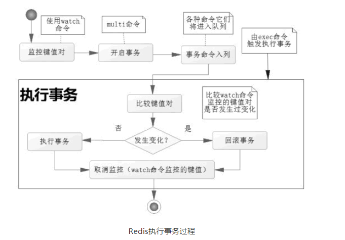

### 1、事务


#### 1.1、程序原子性

- 整个程序中的所有操作，要么全部完成，要不全部不完成，不会停留在中间的某个环节中

----

举例：

- 原子性
  - 数据库中的某个事务A要更新t1表、t2表的某条记录，当事务提交，t1、t2两个表都被更新，若其中一个表操作失败，事务将回滚
- 非原子性
  - 数据库中的某个事务A中要更新t1表、t2表的某条记录，当事务提交，t1、t2两个表都被更新，若其中一个表操作失败，另一个表操作继续，事务不会回滚。（当然对于关系型数据库不会出现非原子性）


### 2、Redis事务

>  关系型数据中的事务都是原子性的，而Redis的事务是非原子性的

- Redis同一个事务中如果有一条命令执行失败，其后的命令仍然会被执行，没有回滚
- Redis 参考了多线程中使用的 CAS（比较与交换，Compare And Swap）去执行的。在数据高并发环境的操作中，我们把这样的一个机制称为乐观锁。

> CAS是乐观锁的一种实现

#### 2.1、事务相关命令

- **`MULTI` ：**开启事务，redis会将后续的命令逐个放入队列中，然后使用**EXEC命令来原子化**执行这个命令系列。标记一个事务块的开始。
- **`EXEC`：**执行事务中的所有操作命令。
- **`DISCARD`：**取消事务，放弃执行事务块中的所有命令。
- **`WATCH`：**监视一个或多个key,如果事务在执行前，这个key(或多个key)被其他命令修改，则事务被中断，不会执行事务中的任何命令。
- **`UNWATCH`：**取消WATCH对所有key的监视。

##### 2.2、使用

1. 开启：以`MULTI`开启一个事务

2. 入队：将多个命令入队到事务中，接到这些命令并不会立即执行，而是放到等待执行的事务队列里面
3. 执行：由`EXEC`命令触发事务

##### 2.2.1、正常执行

- 给`k1`、`k2`分别赋值，在事务中修改`k1`、`k2`，执行事务后，查看`k1`、`k2`值都被修改。

```
127.0.0.1:6379> set k1 v1
OK
127.0.0.1:6379> set k2 v2
OK
127.0.0.1:6379> MULTI
OK
127.0.0.1:6379> set k1 11
QUEUED
127.0.0.1:6379> set k2 22
QUEUED
127.0.0.1:6379> EXEC
1) OK
2) OK
127.0.0.1:6379> get k1
"11"
127.0.0.1:6379> get k2
"22"
```

##### 2.2.2、放弃事务（DISCARD）

```
127.0.0.1:6379> MULTI
OK
127.0.0.1:6379> set k1 33
QUEUED
127.0.0.1:6379> set k2 34
QUEUED
127.0.0.1:6379> DISCARD
OK
```

##### 2.2.3、全体连坐（事务失败处理）

- 语法错误（编译器错误），在开启事务后，修改`k1`值为11，`k2`值为22，但`k2`语法错误，最终导致事务提交失败，`k1`、`k2`保留原值。

```sh 
127.0.0.1:6379> set k1 v1
OK
127.0.0.1:6379> set k2 v2
OK
127.0.0.1:6379> MULTI
OK
127.0.0.1:6379> set k1 11
QUEUED
127.0.0.1:6379> sets k2 22     #错误的命令
(error) ERR unknown command `sets`, with args beginning with: `k2`, `22`, 
127.0.0.1:6379> exec
(error) EXECABORT Transaction discarded because of previous errors.
127.0.0.1:6379> get k1
"v1"
127.0.0.1:6379> get k2
"v2"
127.0.0.1:6379>
```

##### 2.2.4、冤头债主

- `Redis`类型错误（运行时错误），在开启事务后，修改`k1`值为11，`k2`值为22，但将`k2`的类型作为List，在运行时检测类型错误，最终导致事务提交失败，此时事务并没有回滚，而是跳过错误命令继续执行， 结果`k1`值改变、`k2`保留原值。

```shell
127.0.0.1:6379> set k1 v1
OK
127.0.0.1:6379> set k1 v2
OK
127.0.0.1:6379> MULTI
OK
127.0.0.1:6379> set k1 11
QUEUED
127.0.0.1:6379> lpush k2 22  #错误的命令，因为k2是字符串
QUEUED
127.0.0.1:6379> get k1   #任然会执行
QUEUED
127.0.0.1:6379> EXEC
1) OK
2) (error) WRONGTYPE Operation against a key holding the wrong kind of value
3)"11"  
127.0.0.1:6379> get k1
"11"
127.0.0.1:6379> get k2
"v2"
127.0.0.1:6379>
```

#### 2.3、Redis不支持事务回滚

上述例子可知，多数事务失败是由**语法错误**或者**数据结构错误**导致的。语法错误会进行回滚，说明命令入队前就进行检测的，所以此时会进行事务的回滚。而对于数据结构的错误则是在执行时检测的，`Redis`为提升性能而采用这种简单的事务，这就是不同于关系型数据库的。

#### 2.4、WATCH

> 严格的说Redis命令是原子性的，而事务是非原子性的

- 我们要让Redis事务完全具备事务回滚能力，就需要借助命令`WATCH`实现
- 当使用EXEC执行事务时，首先会比对`WATCH`所监控的键值对，如果没发生改变，它会执行事务队列中的命令，提交事务；如果发生变化，将不会执行事务中的任何命令，同时事务回滚。当然无论是否回滚，Redis都会取消执行事务前的`WATCH`命令。



##### 2.4.1、WATCH命令

- 在事务开始前用WATCH监控k1，之后修改k1为11，说明事务开始前k1值被改变，MULTI开始事务，修改k1值为12，k2为22，执行EXEC，发回nil，说明事务回滚；查看下k1、k2的值都没有被事务中的命令所改变。

```shell
127.0.0.1:6379> set k1 v1
OK
127.0.0.1:6379> set k2 v2
OK
127.0.0.1:6379> WATCH k1  #监视
OK
127.0.0.1:6379> set k1 11  #注意：这里是可以设置成功的
OK
127.0.0.1:6379> get k1
"11"
127.0.0.1:6379> MULTI
OK
127.0.0.1:6379> set k1 12  #修改被监视的key
QUEUED
127.0.0.1:6379> set k2 22
QUEUED
127.0.0.1:6379> EXEC
(nil) 					#表明事务失败
127.0.0.1:6379> get k1  #发现事务处理失败，并回滚了
"11"
127.0.0.1:6379> get k2  #监视的key被修改了 整个事务内的其他也回滚
"v2"
127.0.0.1:6379>
```

##### 2.4.2、UNWATCH命令

- 取消见识所有Key

```shell
127.0.0.1:6379> set k1 v1
OK
127.0.0.1:6379> set k2 v2
OK
127.0.0.1:6379> WATCH k1  #监视k1
OK
127.0.0.1:6379> set k1 11
OK
127.0.0.1:6379> UNWATCH  #取消监视k1
OK
127.0.0.1:6379> MULTI
OK
127.0.0.1:6379> set k1 12
QUEUED
127.0.0.1:6379> set k2 22
QUEUED
127.0.0.1:6379> exec
1) OK
2) OK
127.0.0.1:6379> get k1
"12"
127.0.0.1:6379> get k2
"22"
127.0.0.1:6379>
```

##### 2.4.3、总结

- `UNWATCH`一旦执行`EXEC`之前加的监控锁都会被取消掉了
- `WATCH`指令，类似乐观锁，事务提交时，如果Key的值已被别的客户端改变，比如某个list已被别的客户端push/pop过了，整个事务队列都不会被执行
- 通过`WATCH`命令在事务执行之前监控了多个Keys，倘若在`WATCH`之后有任何Key的值发生了变化，`EXEC`命令执行的事务都将被放弃，同时返回Nul应答以通知调用者事务执行失败

### 3、Redis特性

- 单独的隔离操作：事务中的所有命令都会序列化、按顺序地执行。事务在执行的过程中，不会被其他客户端发送来的命令请求所打断。
- 没有隔离级别的概念：队列中的命令没有提交之前都不会实际的被执行，因为事务提交前任何指令都不会被实际执行，也就不存在”事务内的查询要看到事务里的更新，在事务外查询不能看到”这个让人万分头痛的问题
- 不保证原子性：redis同一个事务中如果有一条命令执行失败，其后的命令仍然会被执行，没有回滚
- 单条命令是原子性执行的，但事务不保证原子性，且没有回滚。


[Redis教程](http://c.biancheng.net/view/4544.html)