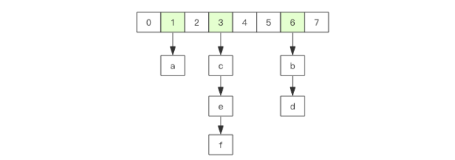

### 1、基本数据结构

> 命令不区分大小写，而key是区分大小写的

#### 1.1、String（字符串）

- 字符串是动态字符串，是可以修改的字符串，内部结构实现上类似于Java的`ArrayList`，采用**预分配冗余空间的方式来减少内存的频繁分配**
- 字符串最大的长度为512M

#### 1.2、List（列表）

- 列表相当于Java语言里面的`LinkedList`，是链表不是数组，意味着列表List插入和删除非常快，时间复杂度都是O(1)，但是索引定位很慢，时间复杂度为O(n)
- 当列表弹出了最后一个元素后，该数据结构自动被删除，内存被回收

- 列表结构常用来做异步队列使用，将需要延后处理的任务结构体序列化成字符串塞进`Redis`列表，另一线程从这个列表轮询数据进行处理。

----

- 右边进左边出：队列
  - `rpush` --->`lpop`

- 右边进右边出：栈
  - `rpush` --->`rpop`

#### 1.3、Hash（字典）

- 字典相当于Java语言里面的`HashMap`，无序字典。内部结构同样是数组+链表的二维结构
- 字典的值只能是字符串
- 字典移除了最后一个元素之后，该数据结构自动被删除，内存被回收

#### 1.4、Set（集合）

- 集合相当于Java语言里面的`HashSet`，内部的键值对是无序的唯一的，内部的时间相当于一个特殊的字典，字典中所有的`value`都是一个值`null`
- 当集合最后一个元素被移除之后，数据结构自动删除，内存被回收

#### 1.5、Zset（有序列表）

- 有序列表，类似于Java语言中的`SortedSet`和`HashMap`结合体，一方面是一个`set`，保证内部的`value`唯一性，另一方面可以给每一个`value`赋予一个`score`，代表这个`value`的排序权重。
- 内部实现用的是一种叫做**跳跃列表**的数据结构
- 当有序列表最后一个元素被移除之后，数据结构自动删除，内存被回收

### 2、通用规则

#### 2.1、creat if not exists

- 如果容器不存在，那就创建一个，再进行操作

#### 2.2、drop if no elements

- 如果容器里元素没有了，那么立即删除元素，释放内存

#### 2.3、过期时间

- `Redis`所有的数据结构都可以设置过期时间，时间到了，`Redis`会自动删除相应的对象，需要注意的是，过期是以对象为单位，比如一个 hash 结构的过期是整个 hash 对象的过期，而不是其中的某个子 key。

- 还有一个需要特别注意的地方是如果一个字符串已经设置了过期时间，然后你调用了
  set 方法修改了它，它的过期时间会消失