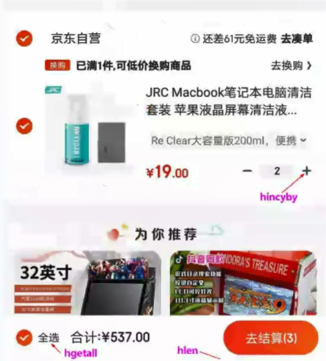
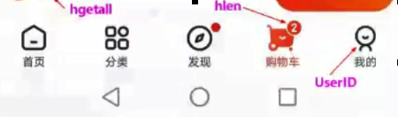
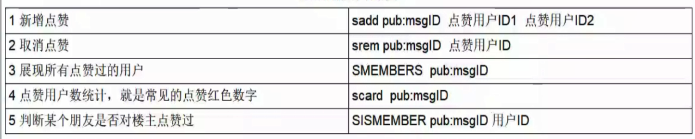
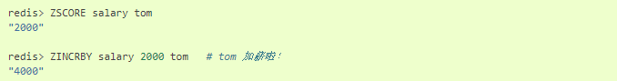
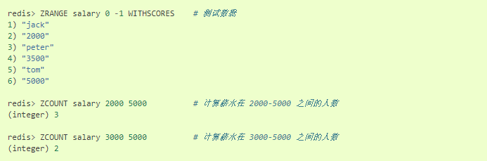

[Redis命令参考](http://redisdoc.com/)

### 1、String(字符串)

#### 1.1、常用指令

- 基本命令
  - `set key value`
  - `get key`

- 同时设置/获取多个键值
  - `MSET key value [key value ....]`
  - `MGET key [key ....]`

- 数值增减
  - 递增数字
    - `INCR key`
  - 增加指定的整数
    - `INCRBY key increment`
  - 递减数值
    - `DECR key`
  - 减少指定的整数
    - `DECRY key decrement`

- 获取字符串长度
  - `STRLEN key`

#### 1.2、分布式锁

- `setnx key value`
- `set key value [Ex seconds][PX milliseconds][NX|XX]`
  - EX：key在多少秒之后过期
  - PX：key在多少毫秒后过期
  - NX：当key不存在的时候，才创建key，效果等同于`setnx`
  - XX：当key存在的时候，覆盖key

```
set lock pay ex 10 NX 	#设置
get lock				#获取
```

#### 1.3、应用场景

- 商品编号、订单编号采用INCR命令生成
- 是否喜欢的文章（人数）
  - `INCR key`，点击一次，增加一次

### 2、Hash（散列类型）

> Map<String,Map<Object,object>>

#### 2.1、常用指令

- 一次设置一个字段值
  - `HSET key field value`

- 一次获取一个字段值
  - `HGET key field`

- 一次设置多个字段值
  - `HMSET key field value [field value ...]`

- 一次获取多个字段值
  - `HMGETkey field [field ....]`

- 获取所有字段值
  - `hgetall key`

- 获取某个key内的全部数量
  - `hlen`

- 删除一个key
  - `hdel`

#### 2.2、应用场景

- 购物车（适用于不是特别特别大的系统）






- 新增商品

  - `hset shopcar:uid1024 334477 1`

  - `hset shopcar:uid1024 334488 1`

- 增加商品数量
  - `hincrby shopcar：uid1024 334488 1`
- 商品总数
  - `hlen shopcar:uid1024`
- 全部选择
  - `hgetall shopcar:uid1024`	 	

### 3、List（列表类型）

#### 3.1、常用指令

- 向列表左边添加元素
  - `LPUSH key value [value ...]`
- 向列表右边添加元素
  - `RPUSH key value [value ....]`
- 查看列表
  - `LRANGE key start stop`
- 获取列表中元素的个数
  - `LLEN key`

#### 3.2、应用场景

- A同学微信关注了公众号：打代码真好、打代码真累
- 两个公众要分别发布了新文章id分别是11、22
  - `lpush likearticle:A同学Id 11 22`
- A同学查看自己订阅的文章，类似分页，下面是0-10条数据
  - `lrange likearticle:A同学Id 0 10`

### 4、Set(集合类型)

#### 4.1、常用指令

- 添加元素
  - `SADD key member[member ...]`
- 删除元素
  - `SREM key member [member ...]`
- 获取集合中的所有元素
  - `SMEMBERS key`
- 判断元素是否在集合中
  - `SISMEMBER key member`
- 获取集合中的元素个数
  - `SCARD key`
- 从集合中随机弹出一个元素，元素不删除
  - `SRANDMEMBER key [数字]`
- 从集合中随机弹出一个元素，出一个删一个
  - `SPOP key[数字]`

#### 4.2、集合运算

##### 4.2.1、集合的差集运算A-B

- 属于A但不属于B的元素构成的集合
  - `SDIFF key [key ...]`

##### 4.2.2、集合的交集运算A∩B

- 属于A同时也属于B的共同拥有的元素构成的集合
  - `SINTER key [key ...]`

##### 4.2.3、集合的并集运算A∪B

- 属于A或者属于B的元素合并后的集合
  - `SUNION key [key ...]`

#### 4.3、应用场景

##### 4.3.1、微信抽奖小程序

- 用户ID，立即参与按钮	
  - `sadd key 用户ID`
- 显示已经有多少人参与了，统计数量	
  - `SCARD key`
- 抽奖(从set中任意选取N个中奖人)	
  - `SRANDMEMBER key 2`       随机抽奖2个人，元素不删除
  - `SPOP key3`                        随机抽奖3个人，元素会删除

##### 4.3.2、微信朋友圈点赞



##### 4.3.3、微博好友关注社交关系

- 共同关注：交集
  - `SINTER 用户1 用户2`
- 是否有共同的爱好
  - `SISMEMBER 用户1 篮球` 存在则表示此用户也喜欢篮球:basketball:

##### 4.3.4、QQ内推可能认识的人

- 属于用户1但是不属于用户2的好友
  - `SDIFF 用户1 用户2`

### 5、Zset(有序集合类型SortedSet)

> 向有序集合中加入一个元素和该元素的分数

#### 5.1、常用指令

- 添加元素
  - `ZADD key score member [score member ...]`
- 按照元素分数从小到大的顺序 返回索引从start到stop之间的所有元素
  - `ZRANGE key start stop [WITHSCORES]`
- 获取元素的分数
  - `ZSCORE key member`
- 删除元素
  - `ZREM key member [member ...]`
- 获取指定分数范围的元素
  - `ZRANGEBYsCORE key min max [WITHSCORES] [LIMIT offset count]`
- 增加某个元素的分数
  - `ZINCRBY key increment member`
    - `increment`增量值
    - `member`成员



- 获取集合中元素的数量
  - `ZCARD key`
- 获得指定分数范围内的元素个数
  - `ZCOUNT key min max`



- 按照排名范围删除元素
  - `ZREMRANGEBYRANK key start stop`
- 获取元素的排名
  - 从小到大
    - `ZRANK key member`
  - 从大到小
    - `ZREVRANK key member`

#### 5.2、应用场景

##### 5.2.1、根据商品销售对商品进行排序显示

> 思路:定义商品销售排行榜(sorted set集合)，key为goods:sellsort，分数为商品销售数量。

- 商品编号1001的销量是9，商品编号1002的销量是15	
  - `zadd goods:sellsort 9 1001 15 1002`
- 有一个客户又买了2件商品1001，商品编号1001销量加2	
  - `zincrby goods:sellsort 2 1001`
- 求商品销量前10名	
  - `ZRANGE goods:sellsort 0 10 withscores`

##### 5.2.2、抖音热搜

- 点击视频	
  - `ZINCRBY hotvcr:20200919 1八佰`
  - `ZINCRBY hotvcr:20200919 15 八佰 2 花木兰`
- 展示当日排行前10条	
  - `ZREVRANGE hotvcr:20200919 0 9 withscores`