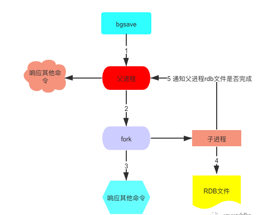
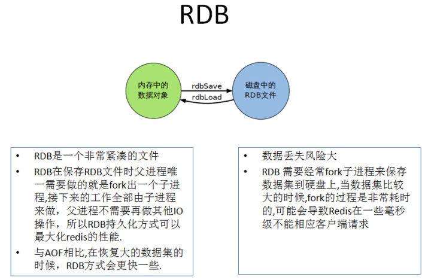
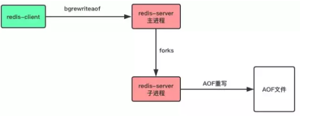
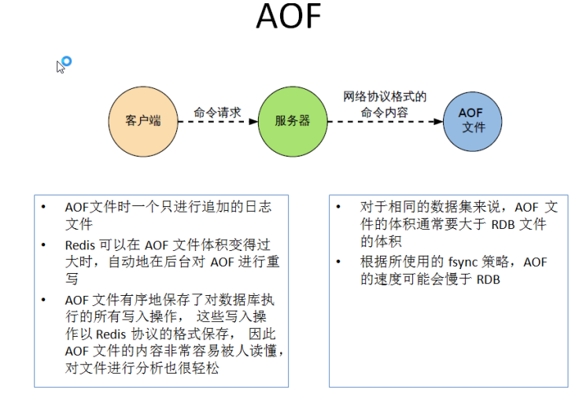
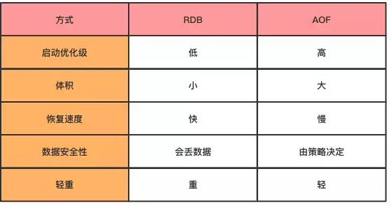

### 1、持久化机制

持久化功能有效地避免因进程退出造成的数据丢失问题，当下次重启时利用之前持久化的文件即可实现数据恢复。持久化数据也就是将内存中的数据写入到硬盘里面，大部分原因是为了之后重用数据（比如重启机器、机器故障之后恢复数据），或者是为了防止系统故障而将数据备份到一个远程位置。

`Redis`支持`RDB`（快照，snapshotting）和`AOF`（只追加文件，append-only file）两种持久化机制。

#### 1.1、快照持久化（RDB）

`RDB`持久化是把当前进程数据生成快照保存到硬盘的过程。

触发`RDB`持久化过程分为**手动触发**和**自动触发**


##### 1.1.1、手动触发

>  Save是阻塞方式的；bgsave是非阻塞方式的。

- save命令
  - 当客户端向`Redis server`发送save命令请求进行持久化时，由于`Redis`是用一个主线程来处理所有，save命令会阻塞`Redis server`处理其他客户端的请求，直到数据同步完成。

- bgsave命令
  - 与save命令不同，`bgsave`是异步执行的，当执行`bgsave`命令之后，`Redis`主进程会fork 一个子进程将数据保存到`rdb`文件中，同步完数据之后，对原有文件进行替换，然后通知主进程表示同步完成。



##### 1.1.2、自动触发

`redis.conf`配置文件中的`SHAPSHOTTING`下面默认有此下配置：

```shell
#在900秒(15分钟)之后，如果至少有1个key发生变化，Redis就会自动触发BGSAVE命令创建快照。
save 900 1
#在300秒(5分钟)之后，如果至少有10个key发生变化，Redis就会自动触发BGSAVE命令创建快照。
save 300 10
#在60秒(1分钟)之后，如果至少有10000个key发生变化，Redis就会自动触发BGSAVE命令创建快照。
save 60 10000


# 是否压缩rdb文件
rdbcompression yes

#dbfilename：持久化数据存储在本地的文件
dbfilename dump.rdb

#dir：持久化数据存储在本地的路径，如果是在/redis/redis-3.0.6/src下启动的redis-cli，则数据会存储在当前src目录下
dir ./
```

##### 1.1.3、恢复

- 重启`redis`服务即可（启动`redis`的server时会从`dump.rdb`中先同步数据），`config get dir`获取目录

##### 1.1.4、停止

- 动态停止所有RDB保存规则的方法：`redis-cli config set save ""`

##### 1.1.5、优缺点

- 优点
  - 适合大规模的数据恢复
  - 对数据完整性和一致性要求不高
  - 因为RDB文件中直接存储的是内存数据，而AOF文件中存储的是一条条命令，需要应用命令。Redis加载RDB文件的速度比AOF快很多。
  - rdb文件非常紧凑，适合于数据备份。
  - 通过RDB进行数据备，由于使用子进程生成，所以对Redis服务器性能影响较小。
- 缺点
  - 在一定间隔时间做一次备份，如果redis意外宕机，就会丢失最后一次快照后的所有修改
  - Fork的时候，内存中的数据被克隆了一份，大致2倍的膨胀性需要考虑
  - RDB持久化方式不能做到实时/秒级持久化。实时持久化要全量刷内存到磁盘，成本太高。每秒fork子进程也会阻塞主进程，影响性能。



#### 1.2、只追加文件持久化（AOF）

以独立日志的方式记录每次写命令（读操作不记录），只允许追加文件但不可以改写文件，重启时在重新执行AOF文件中的命令以此达到恢复数据的目的。AOF的主要作用是解决了数据持久化的实时性。

##### 1.2.1、使用

默认情况下`Redis`没有开启`AOF`方式的持久化，可以通过`appendonly`参数开启：`appendonly yes`

开启`AOF`持久化后每执行一条会更改`Redis`中的数据的命令，`Redis`就会将该命令写入硬盘中的`AOF`文件。`AOF`文件的保存位置和`RDB`文件的位置相同，都是通过`dir`参数设置的，默认的文件名是`appendonly.aof`。

```shell
# 开启aof机制
appendonly yes
# aof文件名
appendfilename "appendonly.aof"
# 写入策略,always表示每个写操作都保存到aof文件中,也可以是everysec或no
appendfsync always
# 默认不重写aof文件
no-appendfsync-on-rewrite no
# 保存目录
dir ~/redis/
```

##### 1.2.2、持久化触发机制

在`Redis`的配置文件中存在三种不同的 `AOF` 持久化方式，位置在配置文件中的`APPENDONLY MODE`下面，它们分别是：

```shell
#每次有数据修改发生时都会写入AOF文件,这样会严重降低Redis的速度，性能较差 但是数据完整性较好
appendfsync always  
#每秒钟同步一次，显示地将多个写命令同步到硬盘，异步操作，如果一秒内宕机，存在数据丢失
appendfsync everysec  
#让操作系统决定何时进行同步   从不同步
appendfsync no        
```

为了兼顾数据和写入性能，用户可以考虑 `appendfsync everysec`选项 ，让`Redis`每秒同步一次AOF文件，`Redis`性能几乎没受到任何影响。而且这样即使出现系统崩溃，用户最多只会丢失一秒之内产生的数据。当硬盘忙于执行写入操作的时候，`Redis`还会优雅的放慢自己的速度以便适应硬盘的最大写入速度。

##### 1.2.3、AOF文件重写

> AOF重写是一个有歧义的名字，该功能是通过读取数据库中的键值对来实现的，程序无须对现有AOF文件进行任何读入、分析或者写入操作。

> Redis会记录上次重写时的AOF大小，默认配置是当AOF文件大小是上次rewrite后大小的一倍且文件大于64M时触发

`AOF`采用文件追加方式，文件会越来越大，为避免出现此种情况，新增了重写机制,当`AOF`文件的大小超过所设定的阈值时，`Redis`就会启动`AOF`文件的**内容压缩**，只保留可以恢复数据的最小指令集。可以使用命令`bgrewriteaof`

```shell
incr num 1incr num 2incr num 3incr num 4incr num 5incr num 6...
incr num 100000
#可以优化成以下命令
set num 100000
```

>  AOF文件是一个二进制文件，并不是像上面的例子一样，直接保存每个命令，而使用Redis自己的格式，上面只是方便演示。

-----

两种重写方式

1. 通过在`redis.conf`配置文件中的选项`no-appendfsync-on-rewrite`可以设置是否开启重写，这种方式会在每次fsync时都重写，影响服务器性以，因此默认值为no，不推荐使用。

```shell
# 默认不重写aof文件
no-appendfsync-on-rewrite no
```

2. 客户端向服务器发送`bgrewriteaof`命令，也可以让服务器进行AOF重写。

```shell
# 让服务器异步重写追加aof文件命令
> bgrewriteaof
```



- 在执行 `BGREWRITEAOF` 命令时，`Redis` 服务器会维护一个 AOF 重写缓冲区，该缓冲区会在子进程创建新AOF文件期间，记录服务器执行的所有写命令。当子进程完成创建新AOF文件的工作之后，服务器会将重写缓冲区中的所有内容追加到新AOF文件的末尾，使得新旧两个AOF文件所保存的数据库状态一致。最后，服务器用新的AOF文件替换旧的AOF文件，以此来完成AOF文件重写操作

重写`AOF`文件的好处

- 压缩AOF文件，减少磁盘占用量。

- 将aof的命令压缩为最小命令集，加快了数据恢复的速度。

##### 1.2.4、AOF文件损坏

在写入aof日志文件时，如果Redis服务器宕机，则aof日志文件文件会出格式错误，在重启Redis服务器时，Redis服务器会拒绝载入这个aof文件，可以通过以下步骤修复aof并恢复数据。

- 备份现在aof文件，以防万一。

- 使用redis-check-aof命令修复aof文件，该命令格式如下：

```
# 修复aof日志文件
$ redis-check-aof -fix file.aof
```

- 重启Redis服务器，加载已经修复的aof文件，恢复数据。

##### 1.2.5、优缺点

- 优点
  - AOF只是追加日志文件，因此对服务器性能影响较小，速度比RDB要快，消耗的内存较少。

- 缺点
  - AOF方式生成的日志文件太大，即使通过AFO重写，文件体积仍然很大。
  - 恢复数据的速度比RDB慢。



#### 1.3、总结

> 只做缓存：如果你只希望你的数据在服务器运行的时候存在,你也可以不使用任何持久化方式

- RDB持久化方式能够在指定的时间间隔能对你的数据进行快照存储

- `AOF`持久化方式记录每次对服务器写的操作,当服务器重启的时候会重新执行这些命令来恢复原始的数据,AOF命令以redis协议追加保存每次写的操作到文件末尾.Redis还能对AOF文件进行后台重写,使得AOF文件的体积不至于过大

----

**同时开启两种持久化方式**

在这种情况下,当`redis`重启的时候会**优先载入AOF文件**来恢复原始的数据,因为在通常情况下AOF文件保存的数据集要比`RDB`文件保存的数据集要完整


**RDB的数据不实时，同时使用两者时服务器重启也只会找AOF文件。那要不要只使用AOF呢？**

作者建议不要，因为RDB更适合用于备份数据库(AOF在不断变化不好备份)，快速重启，而且只有AOF可能潜在的bug，留着作为一个万一的手段。


**性能建议**

因为RDB文件只用作后备用途，建议只在Slave上持久化RDB文件，而且只要15分钟备份一次就够了，只保留save 900 1这条规则。

 

如果开启 AOF，好处是在最恶劣情况下也只会丢失不超过两秒数据，启动脚本较简单只load自己的AOF文件就可以了。代价一是带来了持续的IO，二是AOF rewrite的最后将rewrite过程中产生的新数据写到新文件造成的阻塞几乎是不可避免的。只要硬盘许可，应该尽量减少AOF rewrite的频率，AOF重写的基础大小默认值64M太小了，可以设到5G以上。默认超过原大小100%大小时重写可以改到适当的数值。

 

如果不开启 AOF ，仅靠Master-Slave Replication 实现高可用性也可以。能省掉一大笔IO也减少了rewrite时带来的系统波动。代价是如果Master/Slave同时倒掉，会丢失十几分钟的数据，启动脚本也要比较两个Master/Slave中的RDB文件，载入较新的那个。新浪微博就选用了这种架构

