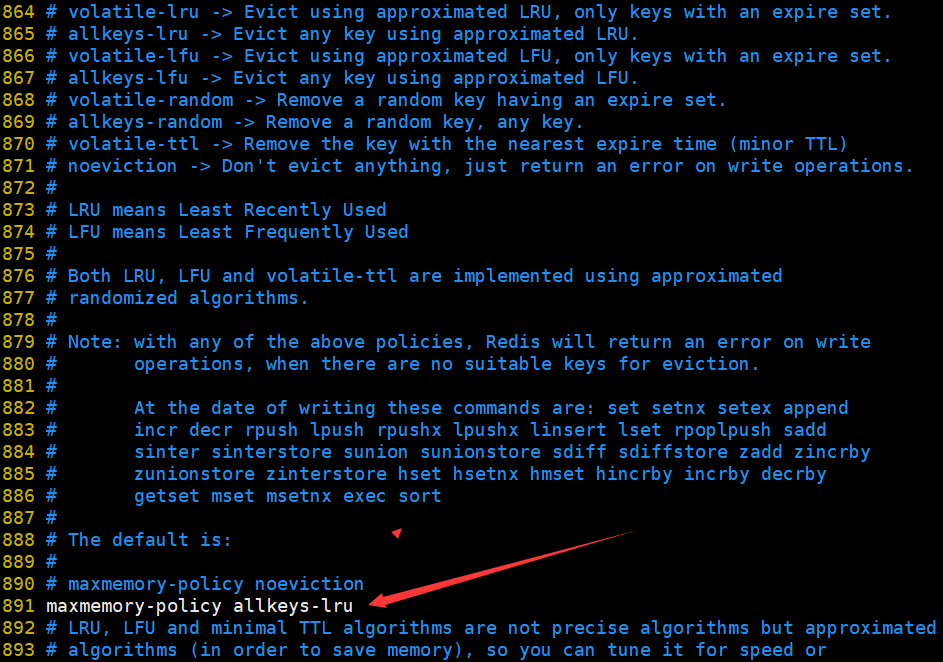

### 1、缓存淘汰策略

> 删除策略存在漏洞，依旧会导致大量的key堆积在内存中，导致内存耗尽

LRU：最近最少使用

LFU：最不经常使用

#### 1.1、淘汰策略

1. `no-eviction`：禁止驱逐数据，也就是说当内存不足以容纳新写入数据时，新写入操作会报错。系统默认的方式
2. `allkeys-lru`：当内存不足以容纳新写入数据时，对所有key使用LRU算法（最近最少使用的key）进行删除【最常用的策略】

3. `volatile-lru`：对所有设置了过期时间的key使用LRU算法进行删除
4. `allkeys-random`: 对所有key随机删除
5. `volatile-random`: 对所有设置了过期时间的key随机删除
6. `allkeys-lfu`: 对所有key使用LFU算法进行删除
7. `volatile-lfu`: 对所有设置了过期时间的key使用LFU算法进行删除

### 2、配置

#### 2.1、命令

```shell
config set maxmemory-policy allkeys-lru  	#设置
config get maxmemory-policy					#获取
1）"maxmemory-policy"
2）"allkeys-lru"
```

#### 2.2、配置文件




