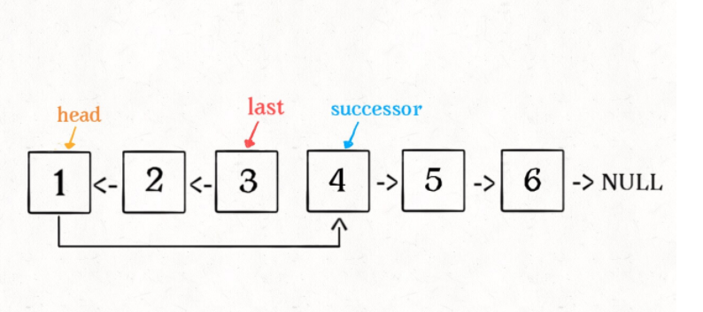

### 1、反转整个链表

说明：反转整个链表

```java
输入: 1->2->3->4->5->NULL
输出: 5->4->3->2->1->NULL 
```

#### 1.1、递归

> 我子节点下的所有节点都已经反转好了，现在就剩我和我的子节点 没有完成最后的反转了，所以反转一下我和我的子节点。

递归的两个条件：

1. 终止条件是当前节点或者下一个节点==null
2. 在函数内部，改变节点的指向，也就是 head 的下一个节点指向 head 递归函数那句

head.next.next = head

- 很不好理解，其实就是 head 的下一个节点指向head。
  递归函数中每次返回的 cur 其实只最后一个节点，在递归函数内部，改变的是当前节点的指向。


代码：

```java
class Solution {
    public ListNode reverseList(ListNode head) {
        //递归终止条件是当前为空，或者下一个节点为空
        if(head==null || head.next==null) {
            return head;
        }
        //这里的cur就是最后一个节点
        ListNode cur = reverseList(head.next);
        //这里请配合动画演示理解
        //如果链表是 1->2->3->4->5，那么此时的cur就是5
        //而head是4，head的下一个是5，下下一个是空
        //所以head.next.next 就是5->4
        head.next.next = head;
        //防止链表循环，需要将head.next设置为空
        head.next = null;
        //每层递归函数都返回cur，也就是最后一个节点
        return cur;
    }
}
```

#### 1.2、双指针迭代

- 定义两个指针： pre和 cur ；pre 在前 cur 在后。

- 每次让 pre 的 next 指向 cur ，实现一次局部反转

- 局部反转完成之后，pre 和 cur 同时往前移动一个位置

- 循环上述过程，直至 pre 到达链表尾部


```java
public ListNode reverseList(ListNode head) {
        //前一个节点
        ListNode pre = head;
        //当前节点
        ListNode cur = null;
        ListNode tmp = null;
        while(pre != null){
            //记录当前节点的下一个节点
            tmp = pre.next;
            //然后将前节点指向当前节点
            pre.next = cur;
            //pre和cur节点都前进一位
            cur = pre;
            pre = tmp;
        }
    }
```

#### 1.3、使用外部空间

1. 先申请一个动态扩容的数组或者容器，比如 ArrayList 这样的。
2. 然后不断遍历链表，将链表中的元素添加到这个容器中。
3. 再利用容器自身的 API，反转整个容器，这样就达到反转的效果了。
4. 最后同时遍历容器和链表，将链表中的值改为容器中的值。


### 2、反转链表前N个节点

1. base case 变为 `n == 1`，反转一个元素，就是它本身，同时**要记录后驱节点**。

2. 刚才我们直接把 `head.next` 设置为 null，因为整个链表反转后原来的 `head` 变成了整个链表的最后一个节点。但现在 `head` 节点在递归反转之后不一定是最后一个节点了，所以要记录后驱 `successor`（第 n + 1 个节点），反转之后将 `head` 连接上。



```java
ListNode successor = null;  //后驱节点
    public ListNode reverseN(ListNode head,int n){
        if (n == 1){
            //记录第n + 1个节点
            successor = head.next();
            return head;
        }
        //以head.next为起点，需要反转前n - 1个节点
        ListNode last = reverseN(head.next, n-1);
        head.next.next = head;
        // 让反转之后的Head节点和后面的节点连接起来
        head.next = successor;
        return last;
    }
```

> 只考虑当前的节点


### 3、反转链表的一部分 

题目：

```java
//反转从位置 m 到 n 的链表。请使用一趟扫描完成反转。 
//
// 说明: 
//1 ≤ m ≤ n ≤ 链表长度。 
//
// 示例: 
//
// 输入: 1->2->3->4->5->NULL, m = 2, n = 4
//输出: 1->4->3->2->5->NULL 
//索引从1开始
```

- 首先，如果 `m == 1`，就相当于反转链表开头的 `n` 个元素嘛，也就是我们刚才实现的功能：

```java
ListNode reverseBetween(ListNode head, int m, int n) {
    // base case
    if (m == 1) {
        // 相当于反转前 n 个元素
        return reverseN(head, n);
    }
    // ...
}
```

如果 `m != 1` 怎么办？如果我们把 `head` 的索引视为 1，那么我们是想从第 `m` 个元素开始反转对吧；如果把 `head.next` 的索引视为 1 呢？那么相对于 `head.next`，反转的区间应该是从第 `m - 1` 个元素开始的；那么对于 `head.next.next` 呢……

```java
class Solution {
    ListNode successor = null;

    public ListNode reverseBetween(ListNode head, int m, int n) {
        // base case
        if (m == 1) {
            return reverseN(head, n);
        }
        // 前进到反转的起点触发 base case
        head.next = reverseBetween(head.next, m - 1, n - 1);
        return head;
    }
    public ListNode reverseN(ListNode head, int n) {
        if (n == 1) {
            // 记录第 n + 1 个节点
            successor = head.next;
            return head;
        }
        // 以 head.next 为起点，需要反转前 n - 1 个节点
        ListNode last = reverseN(head.next, n - 1);

        head.next.next = head;
        // 让反转之后的 head 节点和后面的节点连起来
        head.next = successor;
        return last;
    }
}
```


参考

[labuladong](https://labuladong.gitee.io/algo/%E6%95%B0%E6%8D%AE%E7%BB%93%E6%9E%84%E7%B3%BB%E5%88%97/%E9%80%92%E5%BD%92%E5%8F%8D%E8%BD%AC%E9%93%BE%E8%A1%A8%E7%9A%84%E4%B8%80%E9%83%A8%E5%88%86.html#%E4%BA%8C%E3%80%81%E5%8F%8D%E8%BD%AC%E9%93%BE%E8%A1%A8%E5%89%8D-n-%E4%B8%AA%E8%8A%82%E7%82%B9)