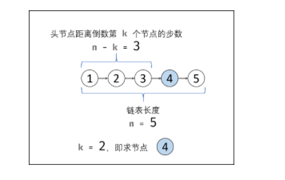

### 1、链表中倒数第K个节点

```java
给定一个链表: 1->2->3->4->5, 和 k = 2.

返回链表 4->5. 
```

#### 1.1、最简单的方法（暴力）

- 将链表中的数据存放到一个数组/集合
- 集合中截取符合要求的数据
- 再插入到一个新的链表

```java
public ListNode getKthFromEnd(ListNode head, int k) {
    	//临界条件判断
        if (head == null || head.next == null){
            return head;
        }
        //存入集合中
        List<Integer> list = new ArrayList();
        ListNode cur = head;
        //判断节点是否为空
        while(cur != null){
            list.add(cur.val);
            cur = cur.next;
        }
        //获取后面的K个节点
        List<Integer> curList = new ArrayList();
        for (int i = list.size() - k;i < list.size();i++) {
            curList.add(list.get(i));
        }
        //插入链表
        ListNode dumy = new ListNode(0);
        //需要一个备用的保存链表
        ListNode res = dumy;
        for (int i = 0;i < curList.size();i++){
            dumy.next = new ListNode(curList.get(i));
            dumy = dumy.next;
        }
        return res.next;
    }
```

#### 1.2、双指针的方法

- 首先自己想到的就是，先获取到链表的长度，然后设置一个指针走了`n-k`步，即可找到链表中倒数的第K个节点

- 直接获取链表的话，需要新建一个集合，跟第一种方法类似，不太好。

  

**优化流程**：双指针

1. 初始化： 前指针 former 、后指针 latter ，双指针都指向头节点 head 。
2. 构建双指针距离： 前指针 former 先向前走 k步（结束后，双指针 former 和 latter 间相距 k步）。
3. 双指针共同移动： 循环中，双指针 former 和 latter 每轮都向前走一步，直至 former 走过链表 尾节点 时跳出（跳出后， latter 与尾节点距离为 k-1，即 latter 指向倒数第 k个节点）。
4. 返回值： 返回 latter 即可。

复杂度分析：

- 时间复杂度 O(N) ： N为链表长度；总体看， former 走了 N 步， latter 走了 (N-k) 步。
- 空间复杂度 O(1)： 双指针 former , latter 使用常数大小的额外空间。

```java
public ListNode getKthFromEnd(ListNode head, int k) {
    if (head == null || head.next == null){
        return head;
    }
    //两个节点，均指向头节点
    ListNode former = head;
    ListNode latter = head;
    //1 2 3 4 5 此时的former位置在数字3
    for (int i = 0;i < k;i++){
        former = former.next;
    }
    //1 2 3 4 5 此时的latter位置在数字4
    while (former != null){
        former = former.next;
        latter = latter.next;
    }
    return latter;
}
```